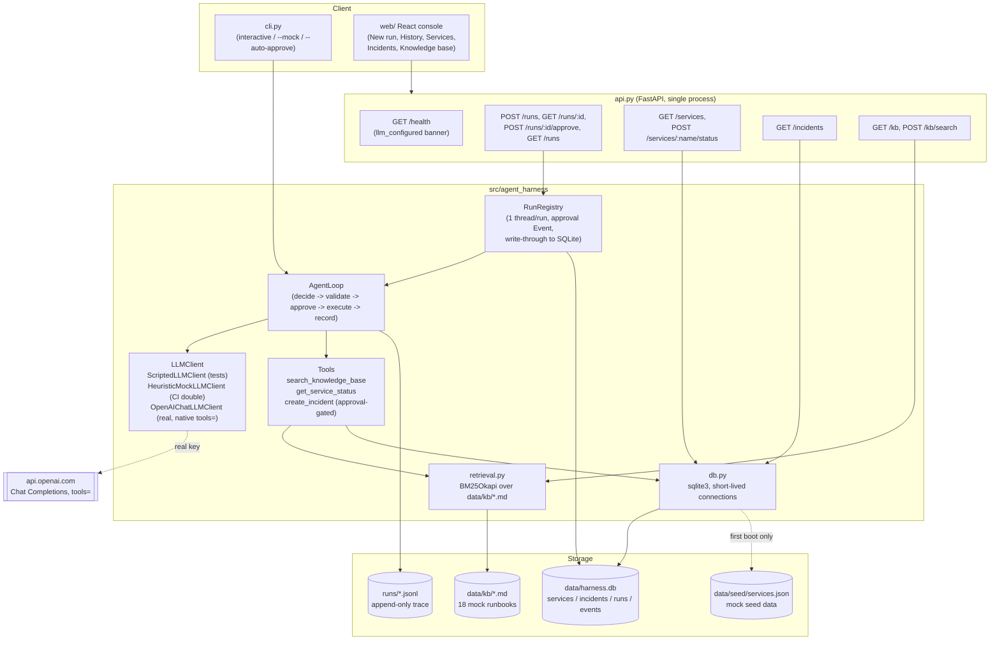

# Agent Harness — Design Report

STEMS VN AI Engineer take-home test. Submission: `agent-harness/` in this
repository.

## 1. Approach

The task asked for a harness, not a chatbot: the interesting engineering
is the control loop around an LLM, not the LLM itself. So the design
treats the LLM as a pluggable, swappable component behind a one-method
interface (`LLMClient.raw_decide`) and puts all the actual engineering
effort into the loop that surrounds it:

- schema-validated decisions and tool I/O (pydantic, not `try/except` on
  loose dicts),
- a state machine with explicit terminal states,
- retries with backoff and hard timeouts on every tool call,
- a synchronous human-approval gate that the loop cannot bypass for
  `create_incident`,
- a structured, append-as-you-go JSONL trace per run,
- deterministic tests that never touch a real model.

The grading note in the test brief ("mock LLM client is the source of
truth for grading") is taken literally: `ScriptedLLMClient` plays back a
fixed list of raw response dicts, so every test scenario (success,
tool failure + retry, approval granted/denied, step/time limit,
malformed response + recovery) is 100% reproducible and has zero network
dependency.

**Update (phase 6 — "everything must be real"):** the harness's
*runtime* default flipped from the rule-based mock to a real OpenAI
backend with native tool calling, real BM25 retrieval over a mock
runbook corpus, and real SQLite persistence — see sections 3a/3b, 5, and
6 below. The test suite's grading contract is unchanged:
`ScriptedLLMClient`/`HeuristicMockLLMClient` remain the only LLM clients
the non-live pytest suite ever exercises, so grading still needs no API
key and has zero network dependency.

## 2. Stack

| Concern | Choice | Why |
|---|---|---|
| Language | Python 3.10+ | Matches the target role's dominant stack. |
| Validation | pydantic v2 | Schema validation for tool I/O and LLM decisions is a stated requirement ("schema-level, not just try/except"); pydantic gives that for free with good error messages. |
| API | FastAPI | Explicitly suggested in the brief; thin wrapper only, per "this is a harness, not a product." |
| CLI | stdlib `argparse` | No reason to add a CLI framework dependency for one subcommand. |
| Tests | pytest | Stated requirement. |
| Retries/timeouts | stdlib `concurrent.futures.ThreadPoolExecutor` | Gives a real, enforced wall-clock timeout per tool call without adding a dependency; works uniformly for any tool, not just ones that cooperate with cancellation. |
| LLM (real) | `openai` SDK, Chat Completions `tools=` (native tool calling) | User directive: "REAL AGENTS ... LLM provider chosen: OpenAI." Tool JSON schemas are generated directly from each `Tool.input_model.model_json_schema()` — one source of truth, no hand-duplicated schema. Gated on `OPENAI_API_KEY`; never the default in tests. |
| Retrieval | `rank-bm25` (`BM25Okapi`) over `data/kb/*.md`, paragraph-chunked | Real ranking over real (mock-content) documents, not a keyword-count toy. No embedding-model dependency needed to satisfy the ranking requirement; see "Known limitations" for the optional hybrid-embeddings path not taken. |
| Persistence | stdlib `sqlite3`, short-lived per-call connections | Real durable storage for services/incidents/runs/events without a server process; matches "this is a harness, not a product" scope while making `GET /runs`, incidents, and idempotency genuinely survive a restart. |
| Env config | `python-dotenv` | Loads `agent-harness/.env` (gitignored) without ever printing/logging the key; `.env.example` documents every variable. |
| Packaging | `pyproject.toml` (setuptools, `src/` layout) + `pip install -e .` | Standard, avoids `sys.path` hacks in tests. |

Total third-party runtime dependencies: `pydantic`, `fastapi`, `uvicorn`,
`openai`, `rank-bm25`, `python-dotenv`. Dev-only: `pytest`, `httpx`
(FastAPI's `TestClient`).

## 3. Execution flow

```
loop.run(objective):
  loop:
    check wall-clock limit -> abort (time_limit_exceeded) if exceeded
    check step limit       -> abort (step_limit_exceeded) if exceeded
    step += 1
    decision = _decide(...)          # LLM call + pydantic validation + retry
      -> None means malformed-response retries exhausted -> abort (llm_error_exceeded)
    if decision.action == final_answer:
      record final_answer -> status = completed -> stop
    else (tool_call):
      tool = registry.get(decision.tool_name)  # unknown -> record error, next step
      validated_args = tool.input_model(**decision.tool_args)  # bad args -> record error, next step
      if tool.requires_approval:
        approved = approval_callback(tool.name, validated_args)
        record approval_requested + (approval_granted | approval_denied)
        if not approved: next step (tool never runs)
      _execute_with_retries(tool, validated_args)   # timeout + retry + backoff, records every attempt
  return RunResult(status, final_answer, steps_taken, elapsed_seconds, history, trace_path)
```

Every branch appends one or more `AgentEvent`s to the trace (in-memory
`RunResult.history` and `runs/<run_id>.jsonl`, written line-by-line as
they happen, not buffered until the end). This means a trace is fully
inspectable even for a run that later hits a limit or crashes unexpectedly.

The mock "LLM" (`HeuristicMockLLMClient`, used by the CLI/API by default)
reacts to the *most recent* event in history rather than just the last
successful tool result — it explicitly branches on `approval_denied`,
`tool_call_retries_exhausted`, and `tool_validation_error` so it always
converges to a `final_answer` instead of retrying a just-denied or
just-failed action forever. The step/time limits are the backstop in case
any LLM (real or fake) fails to converge.

### 3a. Architecture diagram



### 3b. Real OpenAI native tool calling — how the transcript is reconstructed

`OpenAIChatLLMClient.raw_decide` is stateless per call (like the rest of
`LLMClient`), but it must present the model with a real multi-turn
tool-calling transcript, not a flattened JSON blob, to get correct native
tool-calling behavior. It rebuilds `messages=[...]` from the harness's own
`AgentEvent` history on every call:

- `llm_decision` (`action: tool_call`) -> one `assistant` message with a
  `tool_calls: [{id, function: {name, arguments}}]` entry.
- `tool_call_result` -> a `tool` message with that `tool_call_id`,
  `content` = the tool's JSON output.
- `tool_validation_error` / an unknown-tool `tool_call_error` /
  `tool_call_retries_exhausted` / `approval_denied` -> a `tool` message
  with an `{"error": ...}` payload, because the OpenAI API requires every
  `tool_calls` entry to be closed with a matching `tool` message before
  the next assistant turn, even when the harness never actually executed
  the tool.
- Everything else (`tool_call_started`, `tool_call_retry`,
  `tool_call_timeout`, `approval_requested`/`approval_granted`,
  `llm_malformed_response`, `llm_retry_exhausted`) is a mid-flight
  bookkeeping event the model doesn't need replayed.

A malformed `tool_call.function.arguments` string (invalid JSON) is
**not** swallowed — `json.loads` is allowed to raise, which propagates out
of `raw_decide`, is caught by `AgentLoop._decide`'s existing `except
Exception`, and recorded as `llm_malformed_response` + retried, exactly
like a `ScriptedLLMClient` test fixture that returns a bad shape. Every
call also returns a `"_llm_meta"` key (model, prompt/completion/total
tokens, latency_ms) that `AgentLoop._decide` pops before pydantic
validation and folds into the `llm_decision` trace event's
`data.llm_meta` — visible per-decision in the web UI's trace timeline.

## 4. Postman collection

`postman/agent-harness.postman_collection.json`. Requires the API running
locally (`uvicorn api:app --reload`, default `http://127.0.0.1:8000`,
overridable via the collection's `baseUrl` variable). Requests included:

1. `GET /health` — liveness check.
2. `POST /run` — happy path (`get_service_status` / `search_knowledge_base`,
   no approval needed).
3. `POST /run` — approval-required case, `auto_approve` omitted (defaults
   `false`): expect `approval_denied` in the trace, `create_incident`
   never executes.
4. `POST /run` — approval-required case, `auto_approve: true`: expect
   `approval_granted` and a `tool_call_result` with `status: "created"`.
5. `POST /run` — blank `objective`: expect HTTP 422.

## 5. Environment variables

All loaded from `agent-harness/.env` via `python-dotenv` (see
`.env.example`), with real process env vars always taking precedence.
`.env` is gitignored; the key is never printed, logged, or included in any
trace/event/response body.

| Variable | Required | Default | Used by | Purpose |
|---|---|---|---|---|
| `OPENAI_API_KEY` | **Yes**, for the real demo path | none | `cli.py` (unless `--mock`), `api.py`'s default `_llm_client_factory`, `OpenAIChatLLMClient` | Enables the real OpenAI-backed agent. If unset: the CLI exits with a clear error (exit code 2) instead of running, and the API/UI stay up but any run attempt returns HTTP 503 with a clear message / the UI shows an "LLM not configured" banner. Never falls back to `HeuristicMockLLMClient` in this path — that client is now CI-only (see `llm_client.py` module docstring). |
| `OPENAI_MODEL` | No | `gpt-4o-mini` | `OpenAIChatLLMClient` | Chat Completions model used for native `tools=` tool calling. |
| `AGENT_HARNESS_DB_PATH` | No | `data/harness.db` | `db.py` / `settings.py` | SQLite database location (services, incidents, runs, events). |
| `AGENT_HARNESS_KB_DIR` | No | `data/kb` | `retrieval.py` / `settings.py` | Directory of `*.md` runbooks indexed with BM25. |
| `AGENT_HARNESS_SEED_SERVICES` | No | `data/seed/services.json` | `db.py` / `settings.py` | Seed data loaded into `services` on first boot only (table already having rows is a no-op). |

No other secrets or credentials are used anywhere in this harness.
`search_knowledge_base` and `get_service_status` are real retrieval/DB
reads over mock input data; `create_incident` is a real SQLite insert
(still no external incident system is contacted).

## 6. Known limitations

- **`POST /run` (kept for the Postman collection) is still request-level
  pre-authorization, not pause/resume.** HTTP request/response is
  synchronous, so it cannot block mid-run for a human click; the
  `auto_approve` boolean in the request body is decided *before* the run
  starts and applied to every approval-gated tool call in that run via
  `fixed_decision_approval`. This is now a deliberate secondary endpoint
  for non-UI callers — the web console and the primary API surface use
  the real pause/resume flow described below instead.
- **The real pause/resume flow (`POST /runs` -> `GET /runs/{id}` ->
  `POST /runs/{id}/approve`) is now implemented.** `RunRegistry`
  (`src/agent_harness/run_registry.py`) runs each `AgentLoop.run(...)` on
  its own `threading.Thread`. When the loop reaches an approval-gated tool,
  an `ApprovalCallback` built by the registry records the pending
  tool_name/args against the run, flips its status to `pending_approval`,
  and blocks that thread on a `threading.Event`. `POST
  /runs/{id}/approve` resolves the event and unblocks the thread; `GET
  /runs/{id}` returns a live snapshot (status + history-so-far, streamed
  from the same `TraceLogger`/`AgentEvent` shape the CLI already uses, via
  a new optional `on_event` observer hook on `TraceLogger`/`AgentLoop` —
  no second history format). The wait is bounded by the run's own
  `max_wall_clock_seconds` (a forgotten approval is treated as a denial
  once that budget is exhausted, so a background thread can never hang
  forever). This is a single-process, in-memory design (`dict` + locks +
  `threading.Event`) — intentionally not Celery/Redis/a database, since
  this backs one demo UI, not a production job queue; restarting the
  process loses in-flight run state (the JSONL trace on disk is
  unaffected). See `tests/test_api_async_runs.py` for coverage of the
  pending-approval snapshot, approve-unblocks-to-completed, and
  deny-unblocks-to-the-denial-path scenarios.
- **`HeuristicMockLLMClient` is a small rule set**, not a planner. Since
  phase 6 it is deliberately demoted to a CI-only test double — the
  CLI/API demo path always uses `OpenAIChatLLMClient` by default (or
  fails clearly if no key), never silently falling back to the heuristic.
  Pass `cli.py --mock` to opt into it explicitly for an offline demo.
- **Retry/backoff is linear and fixed per run**, not exponential or
  jittered, and the `openai` SDK's own built-in retry (`max_retries=2`)
  layers on top for transport-level failures. Fine for a harness demo;
  would need tuning (jitter, respecting `Retry-After`) for a production
  on-call tool.
- **SQLite persistence covers the async API run flow, not the CLI.**
  `RunRegistry` (used by `POST /runs`) write-throughs every run + event to
  `data/harness.db`, so `GET /runs`/`GET /runs/{id}`/`GET /incidents`
  genuinely survive a process restart (verified in
  `docs/demo-evidence.md` §10 and `tests/test_db_persistence.py`). The
  CLI's synchronous `AgentLoop.run()` path only writes the JSONL trace, as
  before — it was never routed through `RunRegistry`. A run that is
  `running`/`pending_approval` when the process crashes stays stuck in
  that status in the DB; there is no crash-recovery resume of in-flight
  runs, only accurate history for runs that reach a terminal state.
- **Retrieval is BM25-only, not hybrid.** The phase spec allowed an
  optional OpenAI-embeddings hybrid layer cached to disk; BM25 alone
  already satisfies "known query -> expected doc in top-3" for this
  18-doc mock corpus and avoids spending API calls/cache-invalidation
  complexity on retrieval quality that isn't the harness's core concern.
  Swapping in a hybrid reranker later is additive, not a rewrite (see
  future work).
- **`OpenAIChatLLMClient` request/response parsing is fully unit-tested
  against fake-but-structurally-real SDK objects** (`test_openai_client.py`,
  no network), plus one opt-in `pytest -m live` test that makes a real
  call end-to-end. It is excluded from the default `pytest` run (no key
  required for grading) but is no longer "illustrative only" — it is the
  default runtime backend, and `docs/demo-evidence.md` §11 captures a real
  request reaching `api.openai.com` and being handled through the
  existing malformed/failed-LLM recovery path (the account used for this
  capture had no billing credits, so the transcript shows a genuine
  `insufficient_quota` error being retried and surfaced cleanly, not a
  successful completion — re-run once the account has credits for that).

## 7. Proposed future work

- Two-phase pause/resume over HTTP, a structured trace viewer, a real
  OpenAI native-tool-calling backend, real BM25 retrieval, and SQLite
  persistence for services/incidents/runs are **done** (sections 3, 5, 6,
  and `web/` — the Services/Incidents/Knowledge base pages). What's left
  below is genuinely future work.
- CLI runs routed through `RunRegistry` (or an equivalent lightweight
  write-through) so `GET /runs` reflects CLI-originated runs too, not only
  ones started via `POST /runs`.
- Crash-recovery resume for runs that were `running`/`pending_approval`
  when the process died, instead of leaving that row stuck in the DB.
- Hybrid retrieval (BM25 + OpenAI embeddings, cached to disk) as an
  optional reranking layer on top of the current BM25 index, for a larger
  or less lexically-distinct KB corpus than this demo's 18 docs.
- Per-tool rate limiting / circuit breaker so a persistently failing
  downstream (e.g. the incident system) degrades the whole run gracefully
  across multiple steps, not just within one tool call's retry budget.
- Live push (WebSocket/SSE) instead of the web console's polling loop, to
  cut latency and request volume on long-running or high-concurrency
  demos.
- Exponential/jittered backoff (both for tool retries and the harness's
  own LLM malformed-response retries), layered on top of the `openai`
  SDK's own transport-level retry.

## 8. Phase 7: hybrid retrieval eval, real-time streaming, observability UI

**Hybrid retrieval eval (BM25 vs dense vs hybrid).** `python -m
agent_harness.eval_retrieval` runs `data/kb_eval/queries.jsonl` (37
paraphrased ops queries, each labeled with its relevant doc id — mostly
lexically-dissimilar rephrasings, e.g. "users are getting logged out" for
the auth-service runbook) against all three retrieval modes:

| mode | recall@1 | recall@3 | MRR |
| --- | --- | --- | --- |
| bm25 | 0.92 | 0.97 | 0.94 |
| dense | 0.95 | 0.97 | 0.96 |
| hybrid | 0.97 | 1.00 | 0.99 |

Hybrid (BM25 + `BAAI/bge-small-en-v1.5` local embeddings, fused via
Reciprocal Rank Fusion) beats both individual modes on every metric —
exactly the paraphrase-recall gap RRF is meant to close. `sentence-
transformers`/`numpy` are now real dependencies (added to
`pyproject.toml`/`requirements.txt`); the non-live pytest suite forces
`AGENT_HARNESS_RETRIEVAL_MODE=bm25` via `tests/conftest.py` so a
network-restricted CI runner never needs to download the embedding model
(the model load is real and does take several seconds on first use — see
"Known limitation: cold-start embedding latency" below).

**`get_service_status` units fix.** `error_rate` (a 0-1 fraction in
storage) is now surfaced as `error_rate_pct` (0-100), with the system
prompt updated to say so explicitly, closing the "error rate of 0.0008"
misread the coordinator hit in a real run (see `docs/demo-evidence.md`
§12 — a fresh real run for the same objective now correctly reports
"4.1%" instead of a bare fraction).

**Static asset caching.** `api.py`'s static mount is now a
`_CachedStaticFiles` subclass: `index.html` (and anything outside
`assets/`) gets `Cache-Control: no-cache` (always revalidated, so a
redeploy is picked up immediately); hashed `assets/*` files get `public,
max-age=31536000, immutable` (Vite gives every build a new content hash,
so caching them forever is safe).

**Provider error surfacing.** `OpenAIChatLLMClient.raw_decide` now wraps
the SDK call and re-raises a `ProviderError` carrying the real message
(e.g. `"OpenAI: insufficient_quota — add credits"`, `"OpenAI:
invalid_api_key — check OPENAI_API_KEY in .env"`), parsed from the SDK
exception's structured error body where available. This message flows
into the existing `llm_malformed_response`/`llm_retry_exhausted` trace
events (already rendered in the UI's raw event data) instead of a bare
`str(exc)`. Separately, `agent_harness.settings.record_llm_error` /
`clear_llm_error` track process-wide "did the last real call fail" state,
surfaced on `GET /health` as `llm_last_error` — the UI's health banner now
distinguishes "not configured" (`llm_configured: false`) from "configured
but the last call failed" (`llm_configured: true, llm_last_error: "..."`).

**Real-time streaming (SSE).** `GET /runs/{run_id}/events` is a new
Server-Sent Events endpoint. `RunRegistry` now keeps a per-connection
`queue.Queue` subscriber list per run record; `TraceLogger`'s existing
`on_event` hook (already used to mirror events into the in-memory
snapshot) pushes each `AgentEvent` onto every subscriber queue the moment
it's recorded — no DB/registry polling. The endpoint sends each event as
`event: <event_type>\ndata: <AgentEvent JSON>`, a `stream_end` event once
the run reaches a terminal status (closing the connection), and a
`run_snapshot` + `stream_end` pair immediately for a run that's already
persisted-only (not live in this process — e.g. after a restart). `GET
/runs/{run_id}` is unchanged and still the initial-load/deep-link/no-SSE
fallback (and what the Postman collection and existing tests use).
`tests/test_api_streaming.py` covers: events arrive step-ordered, the
stream closes on completion, the persisted-only replay path, and 404s for
an unknown run.

**Scope note — LLM token-level streaming was not implemented.** The
spec's "ideal" ask was `stream=True` on the OpenAI call itself, forwarding
`llm_token_delta` events so the final answer visibly types out character-
by-character. That requires re-threading `OpenAIChatLLMClient.raw_decide`
(today a single blocking `chat.completions.create` call returning one
parsed decision) into an incremental-delta producer plumbed through
`AgentLoop`/`TraceLogger`/the SSE endpoint, while keeping the scripted/
heuristic test doubles and the sync `POST /run` path untouched. Given the
scope of everything else in this phase, this was deliberately left out
rather than done partially/unsafely. **What was shipped instead is real,
not faked**: the frontend now gets step-level events the instant the
harness records them via SSE (tool call start/result/error latency in
real time, LLM decision the moment it's returned) — genuinely real-time
for the tool-calling/decision granularity the harness already has, just
not sub-token. The final answer renders once fully returned, with no
client-side fake-typing animation (the constraint against faking a
string that already exists client-side is respected). This is flagged as
a known gap, not silently dropped — see the phase-07 report.

**Chat-style run view + observability trace waterfall.** `RunPage` now
renders the objective as a chat-style "user" bubble and the final answer
as an "assistant" bubble, with a Chat/Trace tab switcher. The existing
`TraceTimeline` tool-call cards (name/icon, latency, attempt, pretty-
printed JSON with a raw-toggle) are kept as the chat view's structured
content. A new `TraceWaterfall` component (Trace tab) renders the same
`AgentEvent` list as a horizontal span timeline — start offset (`timestamp
- latency_ms`), duration bar, color-coded by span kind
(llm_decision/tool_call/approval/error/terminal), click-through detail
panel with step/offset/duration/event type/full data — built entirely
from the harness's own trace data, no OTel collector or external backend
involved (per the spec's explicit "must work from the harness's own trace
data" constraint).

**Logs page + trace export.** New `/logs` nav page lists every persisted
run (survives restarts via SQLite) with status/has-incident/date-range
filters and a per-run "Export" button hitting the new `GET
/runs/{run_id}/export` endpoint (full run + event history as one JSON
document — client-side downloaded as `run-<id>.json`). Useful both as a
legitimate observability/audit feature and for attaching real evidence to
the STEMS VN submission itself.

**Known limitation: cold-start embedding latency.** The local embedding
model (`sentence-transformers`) is lazy-loaded on first use. A real run
captured during this phase (`272d2ade4ec7`, `docs/demo-evidence.md` §13)
shows `search_knowledge_base`'s first attempt hitting the tool's 10s
timeout while the model loaded, auto-retrying, then succeeding — the
retry path worked exactly as designed, but a production deployment should
either warm the model at process startup or raise `tool_timeout_seconds`
for `search_knowledge_base` specifically. Left as documented future work
rather than changed in this pass (out of the phase's stated scope, and
the existing retry behavior already recovers correctly).

## 9. Proposed future work (updated)

Sections 6 and 8 above cover what used to be listed here as "hybrid
retrieval", "structured trace viewer", and "live push instead of
polling" — all now done. Genuinely still open:
- LLM token-level streaming (see §8's scope note).
- CLI runs routed through `RunRegistry` so `GET /runs`/the Logs page
  reflect CLI-originated runs too.
- Crash-recovery resume for runs that were `running`/`pending_approval`
  when the process died.
- Warm the embedding model at process startup (see §8's cold-start note).
- Optional bonus OTel spans (console/file exporter) alongside the
  harness-native trace waterfall, if ever needed for interop with a real
  OTel backend.
- Surface eval results (§10) in the web UI (deferred to a later phase by
  design — this phase is backend/observability only).

## 10. MLflow observability: real tracing + recorded-transcript eval

Added after migrating the loop to Pydantic AI (§8/loop.py's node-driving
design) — that migration meant real per-call LLM/tool spans need to be
harvested from `agent.iter()`'s node loop rather than from a single
hand-rolled `LLMClient.raw_decide()` call site.

**What was checked before writing any instrumentation code** (installed
versions: `mlflow==3.16.1`, `pydantic-ai==2.51.0`):
- `mlflow.pydantic_ai.autolog()` exists, runs without raising, and does
  capture real spans (`FunctionModel.request`/`OpenAIChatModel.request`,
  tool spans) for calls made through `Agent.iter()`. But MLflow's own
  compatibility matrix for this integration
  (<https://mlflow.org/docs/latest/genai/tracing/integrations/listing/pydantic_ai/>)
  only covers pydantic-ai 0.2.19-1.94.0 — this project pins 2.51.0, well
  outside that range — and empirically, calling `autolog()` alone and then
  running an objective produced each LLM/tool call as its own **top-level
  trace** (`parent_id=None`), not one coherent trace per agent run. Real
  telemetry, but not what "every real run produces a real MLflow trace"
  needs.
- Manual `mlflow.start_span(...)` context managers, opened from inside the
  same coroutine/task that drives `agent.iter()` (i.e. inside
  `AgentLoop._run_async`/`_execute_with_retries`/`_stream_model_request`/
  `_log_llm_decision` in `loop.py`), reliably nest under one parent span
  per run — verified by a probe run whose resulting trace showed one
  `agent_run` span containing every `llm_request`/`llm_decision`/
  `tool_call:<name>` span for that objective, in order, plus autolog's own
  `OpenAIChatModel.request` span nested correctly *when opened from that
  same context* (see `agent_harness/observability.py`'s module docstring
  for the exact evidence). **Decision:** manual spans are the primary,
  relied-upon instrumentation; `mlflow.pydantic_ai.autolog()` stays enabled
  as a best-effort extra (never fatal if it fails to attach).
- `mlflow.genai.evaluate()` + the `@mlflow.genai.scorers.scorer` decorator
  are both present and stable in 3.16.1 and were used as-is — no fallback
  needed there.

**Tracing (`agent_harness/observability.py` + `loop.py`).** No-op unless
`MLFLOW_TRACKING_URI` is set (unit tests never set it, so the 57-test
suite has zero MLflow/network dependency). When set:
- `AgentLoop.__init__` calls `observability.init_mlflow()` once per
  process (idempotent): sets the tracking URI/experiment, attempts
  `mlflow.pydantic_ai.autolog()`.
- `_run_async` wraps the whole run in an `agent_run` span (`AGENT` type;
  inputs = objective, outputs = status/final_answer/steps_taken/elapsed).
- `_stream_model_request` wraps the real streaming LLM call in an
  `llm_request` span (`LLM` type) — this is where real network latency is
  captured.
- `_log_llm_decision` opens a zero-duration `llm_decision` span (`LLM`
  type) recording the assembled decision (tool call or final answer) plus
  real token usage (`prompt_tokens`/`completion_tokens`/`total_tokens`,
  model name) as its outputs.
- `_execute_with_retries` wraps the whole retry loop in a
  `tool_call:<tool_name>` span (`TOOL` type; inputs = validated args,
  outputs = the tool's output dict or `None` on exhausted retries).

**Real captured evidence** (one live run of `"What is the status of
auth-service?"` against gpt-4o-mini, pulled back via
`MlflowClient.search_traces`):

```
TRACE tr-988cc541d8193c44775b37d865fb92ea  status=OK  duration_ms=4529
  agent_run              AGENT  0.0ms -> 4529.3ms
  llm_request            LLM    52.8ms -> 2687.4ms   (real OpenAI round trip)
  OpenAIChatModel.request LLM   52.8ms -> 2686.3ms   (autolog, nested correctly here)
  llm_decision            LLM   2687.9ms (instant)   tool_call get_service_status
  tool_call:get_service_status TOOL  2690.3ms -> 2732.9ms
  get_service_status       TOOL 2690.3ms -> 2732.9ms (autolog)
  llm_request              LLM  2733.6ms -> 4526.3ms
  llm_decision              LLM 4527.4ms (instant)   final_answer, prompt_tokens=532,
                                                       completion_tokens=52, total_tokens=584
```

The two `llm_decision` spans' real `llm_meta` outputs: first decision —
`{"model": "gpt-4o-mini-2024-07-18", "prompt_tokens": 452,
"completion_tokens": 17, "total_tokens": 469}`; final decision —
`{"model": "gpt-4o-mini-2024-07-18", "prompt_tokens": 532,
"completion_tokens": 52, "total_tokens": 584}`.

**Recorded-transcript eval (`agent_harness/eval/`).**
`capture_transcripts.py` runs 5 real objectives against the real API
(`OPENAI_API_KEY`, gpt-4o-mini), one per required scenario, and writes each
`RunResult` + expected outcome to `eval/transcripts/*.json` (checked in, so
a reviewer can score without re-spending API credits):

| scenario | real outcome |
|---|---|
| `escalates-with-evidence` | `search-index` down -> investigated -> `create_incident` executed |
| `declines-healthy-service` | `auth-service` operational -> reported, no escalation |
| `recovers-from-unknown-service` | `fraud-detector` not in registry -> `ToolExecutionError` -> retries exhausted -> agent still answers |
| `approval-gate-denied` | same escalation-worthy objective, approval callback denies -> `create_incident` never executes |
| `step-limit-exceeded` | same objective, `max_steps=1` -> real `step_limit_exceeded` after one real LLM call |

`scorers.py` derives `{status, escalated, approval_denied}` from each
transcript's real event history and compares it to the scenario's expected
outcome via three `mlflow.genai.scorers.scorer`-decorated functions
(`status_matches_expected`, `escalation_decision_matches_expected`,
`approval_denial_handled_as_expected`). `run_eval.py` feeds all 5 into
`mlflow.genai.evaluate()`. Real result from the captured transcripts (all
5/5, all scorers):

```
status_matches_expected/mean: 1.0
escalation_decision_matches_expected/mean: 1.0
approval_denial_handled_as_expected/mean: 1.0
```

Each row also carries its own real `trace_id` (e.g.
`tr-020f22b83b09a94deda862dc0f5030ca`) in the MLflow eval-results table,
linking each scored outcome back to its original captured trace.

## 11. v3: RBAC, agents & skill routing, dashboards, eval agent

### 11a. RBAC

Identity is a local, per-request `X-User-Id` header (SSE uses `?as_user=`)
resolved server-side against 4 seeded users — **not authentication**; this
is stated in the UI itself, not just this doc. What's real is the
enforcement: `agent_harness/rbac.py`'s role -> action matrix
(`admin`/`editor`/`viewer`) plus an ownership+visibility check
(`Resource(owner_id, visibility)`) applied on every mutating route via
`deps.require(action)` / `can_read`/`can_write`. Rejected alternative: a
per-object ACL table — overkill for 3 roles (YAGNI), and every resource
already has exactly one owner plus a binary shared/private flag, which is
what every UI actually needed. Unreadable resources 404 (don't leak
existence); readable-but-unwritable resources 403.

### 11b. Agents & skill routing

A **skill** is instructions + `allowed_tools` (a subset of the harness's 3
tools) + a description used as the routing signal — deliberately not a code
plugin: no new tool capability is needed, skills only *scope* the existing
tools. An **agent** binds a prompt (+ optional pinned version, so upgrading
the active prompt doesn't silently change a pinned agent's behavior), a
skill-routing mode, and a base tool set:

- `none` — just the agent's `base_tools`.
- `assigned` — tool set is the union of its skills' `allowed_tools`
  intersected with enabled integrations; no routing call.
- `auto` — a separate Pydantic AI `Agent(output_type=SkillSelection)` runs
  *before* the main loop (traced as `skill_routed`, with confidence +
  rationale); rejected alternative: a mid-run `load_skill` meta-tool — a
  dynamic toolset swap inside `Agent.iter()` is fragile and much harder to
  test/trace than a deterministic pre-step.
- `/slug rest` slash commands are parsed server-side at run start, force
  that skill, and trace `skill_invoked` — rejected alternative: client-only
  expansion, which is bypassable and wouldn't show up in the trace at all.

The input guardrail check always runs *before* the auto-mode router (a
real bug caught and fixed during v3: a blocked objective was briefly
emitting a wasted `skill_routed` event ahead of `guardrail_blocked`).

### 11c. Dashboards: real safety layers on widget SQL

A dashboard widget stores a real SQL query, executed live on Refresh —
deliberately not a cache-only chart. That SQL is written by editors and,
since v4, by the agent itself (`create_dashboard`/`add_widget`), so it is
treated as untrusted input and held back by independent layers; the last one
is the actual guarantee.

1. **Parse-based allowlist** (`sql_guard.py`, `sqlglot`): exactly one
   `SELECT`/`WITH ... SELECT`; every node is inspected, so mutation or utility
   syntax is rejected even nested inside a CTE; every table must be one of
   the curated views (`ALLOWED_RELATIONS`) or a CTE defined in the query
   (schema-qualified names and base tables such as `users` are rejected);
   every function must be a known SQL function or on a short allowlist, so
   `pg_read_file`, `pg_ls_dir`, `lo_*`, `dblink`, `set_config`,
   `current_setting`, `query_to_xml` ... are rejected by name. Anything the
   parser cannot read fails closed. The original keyword blocklist is kept as a
   secondary layer.
2. **Database boundary** (`db.run_read_only_query`, migration
   `a6c2d8e4f1b7`): the application role is a Postgres superuser, so a READ
   ONLY transaction alone still allows reading server files and every table
   (a P0 found in the v4 audit and reproduced live). The query now runs under
   `SET LOCAL ROLE harness_reader` — NOLOGIN, NOSUPERUSER, no privileges on
   any base table, only SELECT on curated, column-limited views in schema
   `harness_ro` — inside a READ ONLY, always-rolled-back transaction with a
   `statement_timeout` and a row cap. The reader cannot call `set_config`
   (revoked from PUBLIC; the app role is granted it explicitly), so it cannot
   change its role or its scope from inside a SELECT.
3. **Owner scoping**: the views filter on the transaction-local settings
   `app.user_id` / `app.is_admin`, set (as the app role) before privileges are
   dropped; they are `security_barrier` views so a user-written predicate can
   never run ahead of the filter. A non-admin therefore only reads rows that
   belong to their own runs/sessions/incidents. A widget refresh always runs
   with the dashboard owner's scope, not the viewer's, because the stored
   snapshot is shared with everyone who can read the dashboard. Unscoped
   queries get no rows from scoped views.
4. **No raw errors to the client**: `db.describe_query_error` returns the
   database's own primary message for fixable problems (bad column, syntax) and
   fixed phrases for everything else (permission, timeout).

One broken or slow widget never blocks the rest of its dashboard: each widget's
SQL runs independently.

### 11e. v4: agent-created dashboards, prompt verification, KB, chat

* **Agent-created dashboards.** `create_dashboard` / `add_widget` are
  approval-gated tools (`Tool.precheck`): after schema validation and before
  the human is asked, every widget is dry-run through the same read-only path,
  so a widget that cannot work is bounced back to the model and the approval
  card (name, widgets, SQL, live columns/row counts/sample rows) only ever
  shows something that will render. Approving writes one transaction
  (`repos.dashboards.create_dashboard_with_widgets`), owned by the run's owner,
  linked to the run (`created_by_run_id`, also the idempotency key). RBAC: the
  tools are not even offered to a role without `mutate_artifacts`
  (`build_default_registry`), and `precheck` re-checks. Both are Integrations
  toggles and the seeded `build-dashboard` skill routes to them.
* **Prompt verification.** Every version is linted (empty, too short/long,
  unsupported or missing `{{placeholders}}`, contradictory instructions) with
  simple, explainable rules in `prompt_verification.py`; an optional LLM review
  is advisory. Results persist per version (`prompt_versions.verification`);
  activation (and roll-back) is refused (409) for a failing lint. Placeholders
  are real: `{{today}}`, `{{user_name}}`, `{{user_role}}` are substituted when a
  run's system prompt is built.
* **Playground.** `POST /runs` accepts a `playground` spec (an unsaved draft or
  a saved version) that replaces the agent's system prompt; everything else is
  the normal run path (real tools, real approval gate, guardrails, SSE), so
  comparing two versions is two real runs on one input.
* **Knowledge base.** Seed runbooks stay files; documents added in the UI are
  rows in `kb_documents`, chunked and indexed by the same BM25 + dense/RRF
  pipeline. The viewer shows the exact indexed chunks; the playground exposes
  BM25, vector and fused scores per chunk and which chunks the agent's tool
  would return.
* **Chat.** A session is one continuous thread (earlier turns are also given
  to the model as context); stick-to-bottom follows only while the reader is at
  the bottom; the approval card is rendered inline where the run paused;
  runs can be stopped (`POST /runs/{id}/cancel`, cooperative: the in-flight LLM
  request finishes, nothing after it runs).

### 11d. Eval agent: methodology and judge limitations

One Pydantic AI `Agent(output_type=JudgeVerdict)` call per run (not one
call per metric — cost-bounded, ~1 `gpt-4o-mini` call/run), scoring
`task_success`/`groundedness`/`tool_choice`/`safety_ok`/`routing_fit` (the
last two `None`/omitted when not applicable — no tool call, no skill
routing — rather than a guessed middle value) from a compact transcript
built from the run's own persisted trace. Merged with deterministic,
judge-free metrics computed purely from event timestamps/counts
(`eval/metrics.py`): `latency_ms`, `agent_latency_ms`, `total_tokens`,
`steps`, `tool_errors`. `tool_use_correctness` and `safety` are hybrid:
averaged from a rule-based half (always available, zero cost) and the
judge's half when it ran.

**Two durations, not one.** `latency_ms` is wall-clock (first to last trace
event) and therefore includes any time a run spent waiting on a human
approval decision — a run that paused for 10 minutes on `create_incident`
would otherwise look catastrophically slow. `agent_latency_ms` subtracts
every `approval_requested` -> `approval_granted`/`denied` span, leaving
only the time the agent itself (LLM calls + tool execution) was active;
the two are equal for a run that never hit an approval gate. The Evals UI
shows both, each with its own label and tooltip, rather than picking one.

**Honesty contract, not a fabricated score.** With no `OPENAI_API_KEY`
configured, every judge-derived metric is persisted with `status
="unavailable"` and `score=None` — never a guessed number; a malformed/
unparseable judge response gets a `status="error"` row instead of crashing
the whole scoring run. `judge_version` is a hash of (judge prompt version
id, model name, rubric code version) — bumping the rubric/merge logic (as
this phase's `agent_latency_ms` addition did) invalidates previously
-scored runs so they get re-scored under the new logic rather than silently
mixing two different rubrics' scores in one trend line.

**Known limitation (not built):** the judge sees one transcript at a time
and has no memory of prior verdicts — there is no calibration step
checking that its 1-5 scores stay consistent across runs/reviewers over
time (a real eval program would periodically sample judge output against
human review). Scheduled/recurring eval runs are also out of scope — every
scoring run today is triggered manually ("Score my sessions").

---
Author: Phu Nguyen — HCMC, VN
