# Aircraft Component Predictive Maintenance -- POC

Predicts whether an aircraft component will need an **unscheduled removal
within the next 30 flight cycles**, from periodic sensor/inspection data.
Built for a take-home test (no real MRO dataset was supplied), so this repo
also includes a documented, seeded synthetic-data generator.

See `docs/design-report.md` for the full write-up (data prep, splitting
rationale, model comparison, threshold selection, explanations, deployment/
monitoring/retraining plan, cold-start/missing-data/drift handling,
limitations, future work) and `docs/demo-evidence.md` for real captured
output from an actual run, so the result can be reviewed without executing
anything.

## Setup

```powershell
cd mro-predictive-maintenance
python -m venv .venv
.\.venv\Scripts\pip install -r requirements.txt
```

(A `.venv/` is already populated in this deliverable directory if you'd
rather use it directly: `.\.venv\Scripts\python.exe ...`.)

## Run it

```powershell
# 1. Generate the synthetic raw tables (deterministic; ~3 seconds).
.\.venv\Scripts\python.exe data\generate_dataset.py --seed 42

# 2. Build the model-ready feature table from the raw tables.
.\.venv\Scripts\python.exe -m src.features

# 3. Train both models, sweep thresholds, evaluate, explain -- end to end.
.\.venv\Scripts\python.exe -m src.pipeline

# 4. Run the test suite (leakage checks + smoke tests).
.\.venv\Scripts\python.exe -m pytest tests/ -v
```

Step 3 also runs step 2 automatically if `data/processed/model_table.csv`
is missing. Outputs land in:

- `reports/metrics_table.md` -- model comparison table for this run
- `reports/threshold_sweep_<model>.csv` -- full precision/recall/alert-rate sweep
- `reports/feature_importance_<model>.csv` -- permutation importance
- `reports/high_risk_examples.md` -- top test-split predictions with SHAP explanations
- `models/<model>.joblib` -- fitted pipelines

## Layout

```
data/generate_dataset.py   synthetic dataset generator (documented assumptions inline)
data/raw/                  generated raw tables (aircraft, components, sensor snapshots,
                            fault codes, maintenance events)
data/processed/            model-ready table built by src/features.py
src/config.py              shared paths/constants
src/features.py            raw tables -> point-in-time-correct model table
src/splitting.py           leakage-safe group+time train/val/test split
src/modeling.py            LogisticRegression + HistGradientBoostingClassifier pipelines
src/evaluation.py          metrics, threshold sweep, operating-point selection
src/explainability.py      permutation importance + SHAP (with a documented fallback)
src/pipeline.py            end-to-end training/eval CLI (`python -m src.pipeline[--retrain]`)
src/service/               FastAPI live scoring service (see "Live scoring service" below)
tests/                     pytest suite (dataset determinism, leakage, model smoke, service tests)
docs/design-report.md      the submission write-up
docs/demo-evidence.md      real captured console output + example explanations
reports/                   generated metrics/importance/explanation artifacts
models/                    fitted model artifacts (joblib)
dashboard/                 static results UI reading the reports/ artifacts (see "Dashboard" below)
```

## Dashboard

A static results dashboard (`dashboard/`) turns the artifacts in `reports/`
into an actual UI -- overview stats, model comparison with the validation
threshold-sweep curve, feature-importance charts, and the high-risk
leaderboard. It reads a derived JSON file built from the real
`reports/*.csv`, `reports/*.md`, and `docs/*.md` files above -- nothing in
the UI is hand-typed. No backend is required; it's a static Vite/React
build.

```powershell
# 1. Regenerate the dashboard's data file from the real reports/ artifacts
#    (safe to re-run any time the pipeline above is re-run).
.\.venv\Scripts\python.exe dashboard\scripts\build_dashboard_data.py

# 2. Install frontend dependencies (first time only).
cd dashboard
npm install

# 3a. Dev server with hot reload:
npm run dev
# -> opens on http://localhost:5173/

# 3b. OR production build + static preview:
npm run build
npm run preview -- --port 4173
# -> open http://localhost:4173/
```

`dashboard/scripts/build_dashboard_data.py` writes
`dashboard/src/data/dashboard_data.json`; every figure shown in the UI
traces back to a specific `reports/`/`docs/` file read by that script (see
the script's docstring). Layout: `dashboard/src/components/` (Overview,
model comparison + threshold-sweep chart, feature importance, high-risk
leaderboard), `dashboard/src/types.ts` (mirrors the JSON schema),
`dashboard/src/lib/format.ts` (display formatting only, no computed
metrics).

The dashboard has three tabs: **Offline results** (the static sections
above, unchanged), **Live scoring** (pick a real fleet component or edit
feature values, `POST /score` live, shows the score/alert/SHAP bars), and
**Fleet risk** (`GET /fleet/top-risk`, live-scored table). The latter two
require the scoring service running -- see "Live scoring service" below;
if it's unreachable the page shows a banner with the expected URL and the
command to start it, rather than a blank screen.

## Live scoring service

`src/service/` is a FastAPI app that serves the **real, currently-trained**
model live -- it does not read/echo `reports/`, it loads
`models/logistic_regression.joblib` and re-runs the exact same
preprocessing + SHAP code paths used at training time (`src/modeling.py`,
`src/explainability.py`) on each request.

```powershell
# From mro-predictive-maintenance/, with the venv active:
.\.venv\Scripts\python.exe -m pip install -r requirements.txt   # adds fastapi/uvicorn/httpx
.\.venv\Scripts\python.exe -m uvicorn src.service.app:app --port 8100
```

Endpoints (see `docs/demo-evidence.md` section 6 for real captured
transcripts):

| Endpoint | What it does |
|---|---|
| `GET /health` | liveness + whether model artifacts loaded |
| `GET /model-card` | model id, threshold, val/test metrics, training date, feature list -- read verbatim from `reports/model_card.json` |
| `POST /score` | component feature payload -> risk score, alert (score >= threshold), live SHAP factors |
| `GET /fleet/top-risk?n=` | live-scores the latest snapshot of every active component in the held-out **test** split, ranked |

Missing numeric features are accepted as `null` and handled exactly like
training (median-imputed for `logistic_regression`, routed natively for
`hist_gradient_boosting` if that model is ever selected as primary --
`src/config.PRIMARY_MODEL_ID`). Categorical fields are required; an
incomplete or unknown-field payload is rejected with `422` by pydantic
before it reaches the model.

**Dashboard <-> service wiring: CORS, not a Vite proxy.** The dashboard
calls the service directly at `http://localhost:8100` (overridable via the
`VITE_SERVICE_BASE_URL` env var, see `dashboard/src/lib/api.ts`); the
service enables CORS for the dashboard's dev (5173) and preview (4173)
ports (`SERVICE_CORS_ORIGINS` env var to add more). CORS was chosen over a
Vite dev-server proxy because it works identically for `npm run dev`,
`npm run build && npm run preview`, and any future static deployment of
the dashboard, with no proxy config to keep in sync per environment.

## Retraining

```powershell
.\.venv\Scripts\python.exe -m src.pipeline --retrain
```

This is the exact same training run as `python -m src.pipeline` (the flag
documents intent when refreshing a previously-deployed model); it
regenerates `models/*.joblib`, every file under `reports/`, and
`reports/model_card.json` in place. **Restart the scoring service
afterward** (`Ctrl+C`, re-run the `uvicorn` command above) to pick up the
new artifacts -- the service loads them once at startup, by design (one
process serves one model version at a time; roll a new one by retrain +
restart, not a hot-reload).

## v3 — ops layer + HITL maintenance copilot

v3 adds an ops domain (alerts/work orders/reliability KPIs in SQLite),
MLflow-backed training/registry/drift monitoring, a maintenance knowledge
base with hybrid retrieval, and a Pydantic AI copilot with human-in-the-loop
(HITL) approval for any write action. The v1 pipeline above (steps 1-4,
`reports/model_card.json`, `models/v1/`) is untouched and still reproduces
byte-for-byte (`--profile v1`: HGB threshold 0.9405, test recall 0.8214 /
23 of 28, 0 false positives). A second, harder `--profile realistic`
(`reports/realistic/`) is the honest stress test -- see
`docs/design-report.md` for why v1's numbers were too easy.

### One-command run (service + dashboard)

```powershell
cd mro-predictive-maintenance
.\.venv\Scripts\python.exe data\generate_dataset.py --seed 42
.\.venv\Scripts\python.exe -m src.pipeline                      # profile=v1 (default)
.\.venv\Scripts\python.exe -m src.pipeline --profile realistic  # the stress-test profile
.\.venv\Scripts\python.exe -m uvicorn src.service.app:app --port 8100   # do NOT use 8000/8100 for ad-hoc testing -- 8100 is the one fixed dev port; use 8101 for any extra/live verification server
cd dashboard; npm install; npm run dev   # -> http://localhost:5173/
```

The copilot runs **offline-scripted by default** (deterministic, no network,
no API key). Export `OPENAI_API_KEY` before starting the service to switch
it to a real OpenAI backend (`gpt-4o-mini`); `GET /copilot/meta` reports
`mode: "offline-scripted" | "openai"`.

### Architecture

```mermaid
flowchart LR
    subgraph Data
        GEN[data/generate_dataset.py] --> FEAT[src/features.py]
    end
    subgraph Model
        FEAT --> SPLIT[src/splitting.py] --> TRAIN[src/modeling.py + src/calibration.py]
        TRAIN --> EVAL[src/evaluation.py<br/>thresholds + CIs + baselines]
    end
    subgraph MLOps
        EVAL --> MLF[src/tracking.py<br/>MLflow run + registry alias champion]
        MLF --> STORE[src/service/model_store.py]
        STORE --> DRIFT[src/monitoring.py<br/>PSI drift + retrain gate]
    end
    subgraph Ops
        STORE --> SCAN[POST /ops/fleet-scan]
        SCAN --> ALERTS[(alerts / predictions<br/>src/ops/* SQLite)]
        ALERTS --> AUTOMATION[src/copilot/automations.py]
    end
    subgraph Copilot
        AUTOMATION --> AGENT[src/copilot/agent.py<br/>tools + guardrails]
        KB[kb/*.md<br/>src/copilot/retrieval.py] --> AGENT
        AGENT -->|deferred: approval / ask_user| HITL[src/copilot/hitl.py<br/>pause + persist]
        HITL --> WO[(work_orders)]
    end
    subgraph UI
        WO --> DASH[dashboard/src<br/>Fleet / Alerts / Work orders / Copilot / Monitoring]
        DRIFT --> DASH
    end
```



### Dashboard tour (every tab, what it calls)

| Nav | Tab | Backed by |
|---|---|---|
| Operations | Fleet | `GET /fleet/top-risk` (live scoring of the held-out test split) |
| Operations | Alerts | `GET /ops/alerts`, `POST /ops/alerts/{id}/transition` |
| Operations | Work orders | `GET /ops/work-orders`, `POST /ops/work-orders/{id}/close` |
| Operations | Knowledge base | `GET /kb`, `POST /kb/search` (hybrid BM25+TF-IDF retrieval) |
| Operations | Copilot | `POST /copilot/runs` + SSE stream, resolve/cancel, `POST /copilot/fleet-scan` |
| Model | Performance | `GET /model-card`, threshold sweep, calibration reliability curve |
| Model | Explainability | permutation importance + SHAP (`reports/feature_importance_*.csv`) |
| Model | Monitoring | `GET /monitoring/drift`, `GET /monitoring/performance`, `GET /models` (registry) |
| About | Overview / Architecture / How it works / Production design | static narrative, cross-linking to `docs/design-report.md` |

### Identities / roles

The copilot seeds three demo identities (`GET /copilot/meta` → `seeded_users`),
picked in the dashboard's identity switcher (top bar):

| id | role | can approve/deny work-order + grounding approvals? |
|---|---|---|
| `lead.engineer` | lead | yes |
| `planner` | planner | yes |
| `viewer` | viewer | **no** — `POST /copilot/runs/{id}/resolve` returns `403` for approval/deny; a viewer may still answer `ask_user` clarifications (no write action on that path) |

This is a demo-grade identity picker (`X-User` header, no session/password) —
not real authentication; see Limitations.

### Env vars

| Var | Default | Purpose |
|---|---|---|
| `DATABASE_URL` | `sqlite:///data/ops.db` | ops store (alerts/work orders/predictions/copilot runs) |
| `OPENAI_API_KEY` | unset | switches the copilot from offline-scripted to real OpenAI (`gpt-4o-mini`) |
| `SERVICE_CORS_ORIGINS` | dashboard dev/preview ports | CORS allow-list for the dashboard |
| `VITE_SERVICE_BASE_URL` | `http://localhost:8100` | dashboard → service base URL |
| `MLFLOW_DISABLE_AGENT_HINT` | unset | silence MLflow's assistant-skill hint in test output |

### Test commands

```powershell
.\.venv\Scripts\python.exe -m pytest -q                       # full suite, offline scripted copilot
$env:OPENAI_API_KEY = "<key>"; .\.venv\Scripts\python.exe -m pytest -q -m live   # + opt-in real-LLM tests
.\.venv\Scripts\python.exe -m pytest -q -m e2e                 # scripted end-to-end scenario only
cd dashboard; npm run build; npm test -- --run
```

### Known limitations

- **No real authentication** — the identity picker is a demo header
  (`X-User`), not login/session/password.
- **SQLite single-writer** — fine for a demo/POC; a real deployment needs
  Postgres for concurrent writers.
- **Fictional knowledge base** — `kb/*.md` are authored-for-this-test
  maintenance procedures, not real OEM AMM/MEL content; KB eval numbers
  (below) measure retrieval quality against this fictional corpus only.
- **Offline mode is a scripted router**, not a smaller real LLM — it proves
  the HITL plumbing deterministically but isn't a quality bar on language
  understanding the way the real OpenAI mode is.
- Synthetic dataset only — see `docs/design-report.md` for why v1's profile
  was too easy and what the `realistic` profile does differently.

## Dependencies

`requirements.txt`: pandas, numpy, scikit-learn, matplotlib, scipy, joblib,
shap, tabulate, pytest, fastapi, uvicorn, httpx. All pip-installable, no
GPU/CUDA required. `xgboost` was evaluated but not used --
`HistGradientBoostingClassifier` (plain scikit-learn) was preferred to keep
the dependency footprint minimal per the take-home's design guidance; see
`docs/design-report.md`. `dashboard/`'s frontend deps (react, recharts,
vite) are separate, in `dashboard/package.json`.

---
Author: Phu Nguyen — HCMC, VN
