# Aircraft Component Predictive Maintenance -- POC

Predicts whether an aircraft component will need an **unscheduled removal
within the next 30 flight cycles**, from periodic sensor/inspection data.
No real MRO dataset is available for this proof of concept, so this repo
also includes a documented, seeded synthetic-data generator.

See `docs/design-report.md` for the full write-up (data prep, splitting
rationale, model comparison, threshold selection, explanations, deployment/
monitoring/retraining plan, cold-start/missing-data/drift handling,
limitations, future work) and `docs/demo-evidence.md` for real captured
output from an actual run, so the result can be reviewed without executing
anything. The repository-level overview, requirements coverage and run
guide are in the [root README](../README.md).

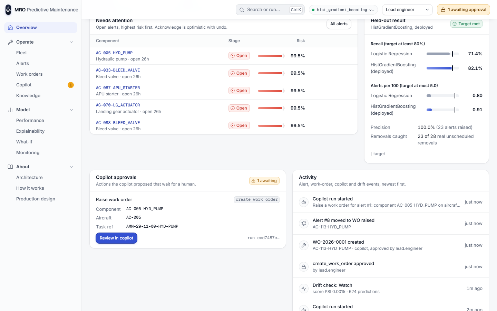

## Video walkthrough

[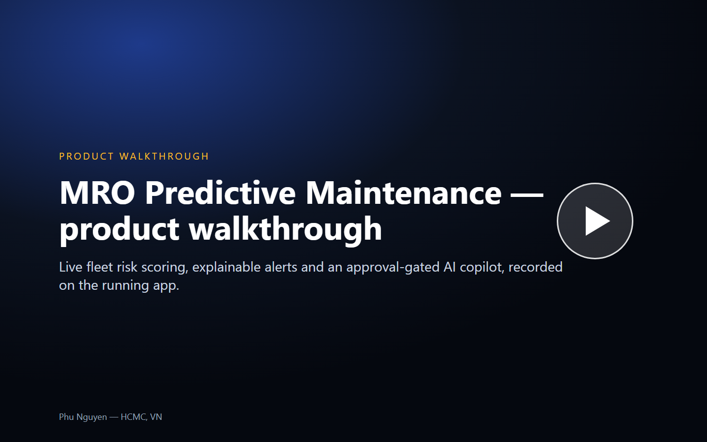](docs/videos/mro-walkthrough.mp4)

A 4:57 narrated, captioned walkthrough recorded on the running app (real API, real model, real LLM copilot runs; long LLM waits are sped up, never faked). File: [`docs/videos/mro-walkthrough.mp4`](docs/videos/mro-walkthrough.mp4) (1440x900, H.264 + AAC voiceover). GitHub does not inline-play MP4 files stored in a repo: click the poster to open the file view, then play it there or use **Download raw file**.

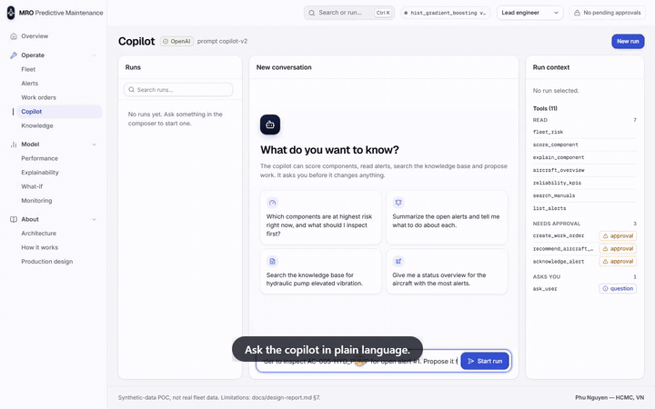

| Time | # | Chapter |
|---|---|---|
| 0:28 | 1 | The control desk |
| 0:48 | 2 | Acknowledge with undo |
| 0:59 | 3 | The whole fleet, ranked |
| 1:19 | 4 | Bulk triage and export |
| 1:34 | 5 | One component, explained |
| 1:56 | 6 | Alerts inbox and sheet |
| 2:11 | 7 | Ask the copilot |
| 2:28 | 8 | Approve, and a work order exists |
| 2:40 | 9 | Deny and search |
| 3:01 | 10 | Close the loop |
| 3:30 | 11 | Is the model any good? |
| 3:46 | 12 | Why, and what if |
| 4:04 | 13 | Drift and retrain |
| 4:15 | 14 | Roles, knowledge, navigation |

## Setup

Prerequisites: Python 3.10 or newer (developed and tested on 3.11) and, for
the dashboard, Node.js 18 or newer.

```powershell
cd mro-predictive-maintenance
python -m venv .venv
.\.venv\Scripts\Activate.ps1
pip install -r requirements.txt
```

macOS / Linux: `python3 -m venv .venv && source .venv/bin/activate && pip install -r requirements.txt`.

The commands below use `.\.venv\Scripts\python.exe`; with the venv active you
can use plain `python` (or `python3`) instead.

## Run it

```powershell
# 1. Generate the synthetic raw tables (deterministic; ~3 seconds).
.\.venv\Scripts\python.exe data\generate_dataset.py --seed 42

# 2. Build the model-ready feature table from the raw tables.
.\.venv\Scripts\python.exe -m src.features

# 3. Train both models, sweep thresholds, evaluate, explain -- end to end.
.\.venv\Scripts\python.exe -m src.pipeline

# 4. Run the test suite (leakage checks + smoke tests).
.\.venv\Scripts\python.exe -m pytest tests/ -v
```

Step 3 also runs step 2 automatically if `data/processed/model_table.csv`
is missing. Outputs land in:

- `reports/metrics_table.md` -- model comparison table for this run
- `reports/threshold_sweep_<model>.csv` -- full precision/recall/alert-rate sweep
- `reports/feature_importance_<model>.csv` -- permutation importance
- `reports/high_risk_examples.md` -- top test-split predictions with SHAP explanations
- `models/<model>.joblib` -- fitted pipelines

## Layout

```
data/generate_dataset.py   synthetic dataset generator (documented assumptions inline)
data/raw/                  generated raw tables (aircraft, components, sensor snapshots,
                            fault codes, maintenance events)
data/processed/            model-ready table built by src/features.py
src/config.py              shared paths/constants
src/features.py            raw tables -> point-in-time-correct model table
src/splitting.py           leakage-safe group+time train/val/test split
src/modeling.py            LogisticRegression + HistGradientBoostingClassifier pipelines
src/evaluation.py          metrics, threshold sweep, operating-point selection
src/explainability.py      permutation importance + SHAP (with a documented fallback)
src/pipeline.py            end-to-end training/eval CLI (`python -m src.pipeline[--retrain]`)
src/service/               FastAPI live scoring service (see "Live scoring service" below)
src/ops/, src/copilot/     alerts / work orders store and the approval-gated maintenance copilot
src/monitoring.py          PSI drift monitoring and the retrain gate
kb/                        fictional maintenance procedures (copilot knowledge base)
scripts/reset_demo_data.py return demo data to the seeded state
tests/                     pytest suite (232 tests: dataset determinism, leakage, model, service, ops, copilot)
docs/design-report.md      the full design write-up
docs/demo-evidence.md      real captured console output + example explanations
reports/                   generated metrics/importance/explanation artifacts
models/                    fitted model artifacts (joblib)
dashboard/                 React + TypeScript dashboard (see "Dashboard" below)
```

## Dashboard

`dashboard/` is a React + TypeScript app (Vite). It combines two data
sources:

- **Offline artifacts.** `dashboard/scripts/build_dashboard_data.py` reads the
  real `reports/*.csv`, `reports/*.md` and `docs/*.md` files and writes
  `dashboard/src/data/dashboard_data.json` (committed). Nothing in the UI is
  hand-typed. Re-run the script after re-running the pipeline.
- **The live scoring service** on `:8100` for fleet, alerts, work orders,
  copilot, monitoring and what-if. If the service is unreachable the page
  shows a banner with the expected URL and the command to start it, rather
  than a blank screen.

```powershell
# Optional: regenerate the dashboard data file from reports/
.\.venv\Scripts\python.exe dashboard\scripts\build_dashboard_data.py

cd dashboard
npm install                 # first time only
npm run dev                 # http://localhost:5173/  (hot reload)
# or a production build:
npm run build               # type check + Vite build
npm run preview -- --port 4173   # http://localhost:4173/
```

See "Dashboard tour" below for every page and the endpoint behind it.

## Live scoring service

`src/service/` is a FastAPI app that serves the **real, currently-trained**
model live -- it does not read/echo `reports/`, it loads
the primary model (`models/hist_gradient_boosting.joblib`, `src/config.PRIMARY_MODEL_ID`) and re-runs the exact same
preprocessing + SHAP code paths used at training time (`src/modeling.py`,
`src/explainability.py`) on each request.

```powershell
# From mro-predictive-maintenance/, with the venv active:
.\.venv\Scripts\python.exe -m pip install -r requirements.txt   # adds fastapi/uvicorn/httpx
.\.venv\Scripts\python.exe -m uvicorn src.service.app:app --port 8100
```

Endpoints (see `docs/demo-evidence.md` section 6 for real captured
transcripts):

| Endpoint | What it does |
|---|---|
| `GET /health` | liveness + whether model artifacts loaded |
| `GET /model-card` | model id, threshold, val/test metrics, training date, feature list -- read verbatim from `reports/model_card.json` |
| `POST /score` | component feature payload -> risk score, alert (score >= threshold), live SHAP factors |
| `GET /fleet/top-risk?n=` | live-scores the latest snapshot of every active component in the held-out **test** split, ranked |
| `GET /fleet/components?offset=&limit=&band=&component_type=&aircraft_type=&q=&sort=&dir=` | the same ranking for the whole fleet, paginated server-side; each row carries its global `rank` and a `band` (`alert` at/over the threshold, `watch` at/over `WATCH_FLOOR` = 0.5, else `normal`); `counts` are whole-fleet per band; `component_types` and `aircraft_types` feed the filters |

Missing numeric features are accepted as `null` and handled exactly like
training (routed natively by `hist_gradient_boosting`, the served model;
median-imputed for `logistic_regression`). Categorical fields are required; an
incomplete or unknown-field payload is rejected with `422` by pydantic
before it reaches the model.

**Dashboard <-> service wiring: CORS, not a Vite proxy.** The dashboard
calls the service directly at `http://localhost:8100` (overridable via the
`VITE_SERVICE_BASE_URL` env var, see `dashboard/src/lib/api.ts`); the
service enables CORS for the dashboard's dev (5173) and preview (4173)
ports (`SERVICE_CORS_ORIGINS` env var to add more). CORS was chosen over a
Vite dev-server proxy because it works identically for `npm run dev`,
`npm run build && npm run preview`, and any future static deployment of
the dashboard, with no proxy config to keep in sync per environment.

## Retraining

```powershell
.\.venv\Scripts\python.exe -m src.pipeline --retrain
```

This is the exact same training run as `python -m src.pipeline` (the flag
documents intent when refreshing a previously-deployed model); it
regenerates `models/*.joblib`, every file under `reports/`, and
`reports/model_card.json` in place. **Restart the scoring service
afterward** (`Ctrl+C`, re-run the `uvicorn` command above) to pick up the
new artifacts -- the service loads them once at startup, by design (one
process serves one model version at a time; roll a new one by retrain +
restart, not a hot-reload).

## v3 — ops layer + HITL maintenance copilot

v3 adds an ops domain (alerts/work orders/reliability KPIs in SQLite),
MLflow-backed training/registry/drift monitoring, a maintenance knowledge
base with hybrid retrieval, and a Pydantic AI copilot with human-in-the-loop
(HITL) approval for any write action. The v1 pipeline above (steps 1-4,
`reports/model_card.json`, `models/v1/`) is untouched and still reproduces
byte-for-byte (`--profile v1`: HGB threshold 0.9405, test recall 0.8214 /
23 of 28, 0 false positives). A second, harder `--profile realistic`
(`reports/realistic/`) is the honest stress test -- see
`docs/design-report.md` for why v1's numbers were too easy.

### One-command run (service + dashboard)

```powershell
cd mro-predictive-maintenance
# The data, models and reports are committed; the next three lines only rebuild them.
.\.venv\Scripts\python.exe data\generate_dataset.py --seed 42
.\.venv\Scripts\python.exe -m src.pipeline                      # profile=v1 (default)
.\.venv\Scripts\python.exe -m src.pipeline --profile realistic  # the stress-test profile
.\.venv\Scripts\python.exe -m uvicorn src.service.app:app --port 8100   # 8100 is the port the dashboard expects; use another port (for example 8101) for extra ad-hoc servers
cd dashboard; npm install; npm run dev   # -> http://localhost:5173/
```

The copilot runs **offline-scripted by default** (deterministic, no network,
no API key). Export `OPENAI_API_KEY` before starting the service to switch
it to a real OpenAI backend (`gpt-4o-mini`); `GET /copilot/meta` reports
`mode: "offline-scripted" | "openai"`.

On first start `data/ops.db` has no alerts. Open the Fleet page and click
**Scan fleet now** (or `POST /ops/fleet-scan`) to score the fleet and raise
the first alerts.

### Architecture

```mermaid
flowchart LR
    subgraph Data
        GEN[data/generate_dataset.py] --> FEAT[src/features.py]
    end
    subgraph Model
        FEAT --> SPLIT[src/splitting.py] --> TRAIN[src/modeling.py + src/calibration.py]
        TRAIN --> EVAL[src/evaluation.py<br/>thresholds + CIs + baselines]
    end
    subgraph MLOps
        EVAL --> MLF[src/tracking.py<br/>MLflow run + registry alias champion]
        MLF --> STORE[src/service/model_store.py]
        STORE --> DRIFT[src/monitoring.py<br/>PSI drift + retrain gate]
    end
    subgraph Ops
        STORE --> SCAN[POST /ops/fleet-scan]
        SCAN --> ALERTS[(alerts / predictions<br/>src/ops/* SQLite)]
        ALERTS --> AUTOMATION[src/copilot/automations.py]
    end
    subgraph Copilot
        AUTOMATION --> AGENT[src/copilot/agent.py<br/>tools + guardrails]
        KB[kb/*.md<br/>src/copilot/retrieval.py] --> AGENT
        AGENT -->|deferred: approval / ask_user| HITL[src/copilot/hitl.py<br/>pause + persist]
        HITL --> WO[(work_orders)]
    end
    subgraph UI
        WO --> DASH[dashboard/src<br/>Fleet / Alerts / Work orders / Copilot / Monitoring]
        DRIFT --> DASH
    end
```

### Dashboard tour (every tab, what it calls)

| Nav | Tab | Backed by |
|---|---|---|
| Overview | Control desk | `GET /ops/alerts` (inline Acknowledge with undo), `GET /copilot/pending` (approvals card), `GET /ops/activity` (feed of real alert, work-order, copilot and drift events; bursts collapsed) |
| Operations | Fleet | `GET /fleet/components` (all scored components, paginated, Alert/Watch/Normal bands, bulk select with triage/acknowledge/export, cards on phones) |
| Operations | Component | tabs Overview / History / Related / Raw (`?tab=`), inline copilot entry with the component and alert attached |
| Operations | Alerts | `GET /ops/alerts`, `POST /ops/alerts/{id}/transition` |
| Operations | Work orders | `GET /ops/work-orders`, `POST /ops/work-orders/{id}/close`, Export CSV of the rows in view |
| Operations | Knowledge base | `GET /kb`, `POST /kb/search` (hybrid BM25+TF-IDF retrieval) |
| Operations | Copilot | `POST /copilot/runs` + SSE stream, resolve/cancel, `POST /copilot/fleet-scan`; run search; `?run=<id>` opens a run |
| Model | Performance | `GET /model-card` (incl. the confusion matrix from `test_at_threshold`), threshold sweep, calibration reliability curve |
| Model | Explainability | permutation importance + SHAP (`reports/feature_importance_*.csv`) |
| Model | Monitoring | `GET /monitoring/drift` ("Run drift check" records a real snapshot), `GET /monitoring/performance`, `GET /models` (registry), `POST /models/retrain` ("Retrain", lead.engineer only, polled with progress and toasts) |
| Model | What-if | `POST /score`; "Copy scenario link" puts the changed fields in `?s=field:value,...` |
| About | Overview / Architecture / How it works / Production design | static narrative, cross-linking to `docs/design-report.md` |

### Identities / roles

The copilot seeds three demo identities (`GET /copilot/meta` → `seeded_users`),
picked in the dashboard's identity switcher (top bar):

| id | role | can approve/deny work-order + grounding approvals? |
|---|---|---|
| `lead.engineer` | lead | yes |
| `planner` | planner | yes |
| `viewer` | viewer | **no** — `POST /copilot/runs/{id}/resolve` returns `403` for approval/deny; a viewer may still answer `ask_user` clarifications (no write action on that path) |

`viewer` is **read-only everywhere**, not only on copilot approvals. Every
endpoint that changes operational data returns `403` for it:
`POST /ops/alerts/{id}/transition`, `POST /ops/work-orders`,
`POST /ops/work-orders/{id}/close`, `POST /ops/aircraft/{id}/status`,
`POST /ops/fleet-scan`, `POST /copilot/fleet-scan` and
`PATCH /copilot/automations/{id}` (`src/copilot/identity.py::can_write`).
The dashboard mirrors this: write controls are disabled with the reason
("Viewer is read-only. lead.engineer or planner can …") and show a lock in
place of their icon, and a banner offers to switch identity. A viewer can still read every page and ask the copilot
questions.

This is a demo-grade identity picker (`X-User` header, no session/password) —
not real authentication; see Limitations.

### Env vars

| Var | Default | Purpose |
|---|---|---|
| `DATABASE_URL` | `sqlite:///data/ops.db` | ops store (alerts/work orders/predictions/copilot runs) |
| `OPENAI_API_KEY` | unset | switches the copilot from offline-scripted to real OpenAI |
| `OPENAI_MODEL` | `gpt-4o-mini` | chat model used when the key is set |
| `MLFLOW_TRACKING_URI` | local `mlruns/` file store | override the MLflow tracking location |
| `SERVICE_CORS_ORIGINS` | dashboard dev/preview ports | CORS allow-list for the dashboard |
| `VITE_SERVICE_BASE_URL` | `http://localhost:8100` | dashboard → service base URL |
| `MLFLOW_DISABLE_AGENT_HINT` | unset | silence MLflow's assistant-skill hint in test output |

### Test commands

```powershell
.\.venv\Scripts\python.exe -m pytest -q                       # full suite, offline scripted copilot
$env:OPENAI_API_KEY = "<key>"; .\.venv\Scripts\python.exe -m pytest -q -m live   # + opt-in real-LLM tests
.\.venv\Scripts\python.exe -m pytest -q -m e2e                 # scripted end-to-end scenario only
cd dashboard; npm run build; npm test -- --run
```

Current results: 232 backend tests pass (3 `live` tests are deselected by
default) and 213 dashboard tests pass (31 files); the dashboard build passes.

### Reset the demo data

Demo actions (acknowledging alerts, raising and closing work orders, copilot
runs) persist in `data/ops.db`. To return it to the freshly seeded state:

```powershell
.\.venv\Scripts\python.exe scripts\reset_demo_data.py          # add --keep-copilot-runs to keep run history
```

It keeps the fleet-scan alerts (same ids and scores), predictions, drift
snapshots and the default automation; every alert goes back to `open`, and
work orders, aircraft-status overrides and copilot runs are removed. It is
safe to run while the service is up; the dashboard shows the clean state on
its next refresh. `tests/test_reset_demo_data.py` covers it.

### Screenshots and flows

All captured from the live service and dashboard (1440 px desktop, 390 px
phone). Files are in `docs/images/`.

| Overview | Fleet | Component |
|---|---|---|
|  | 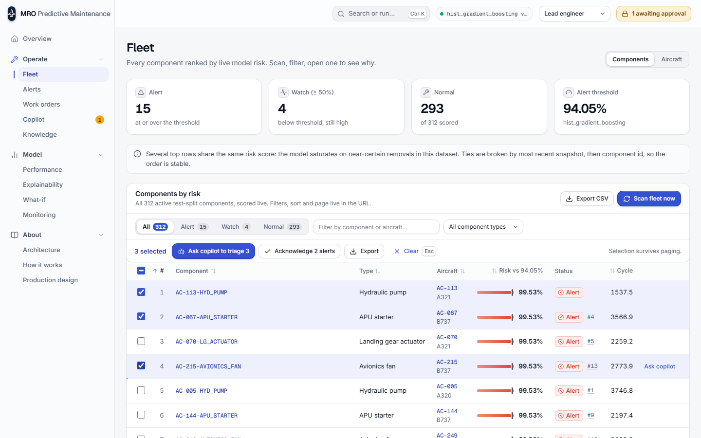 | 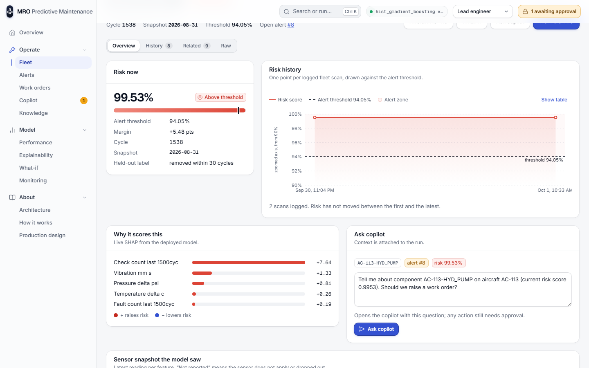 |
| **Alert sheet** | **Copilot, approved tool call** | **What-if** |
| 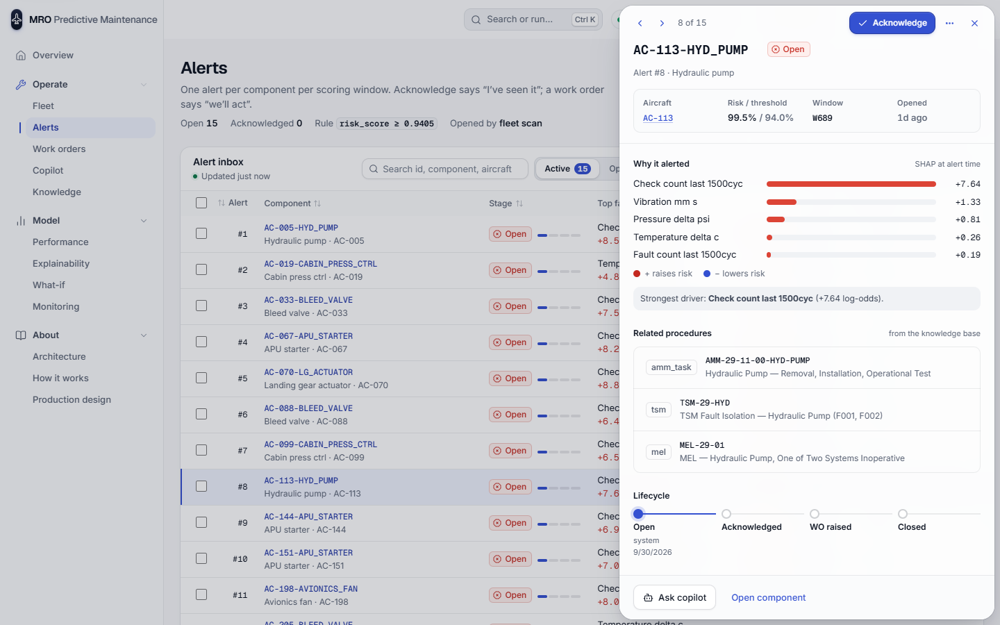 | 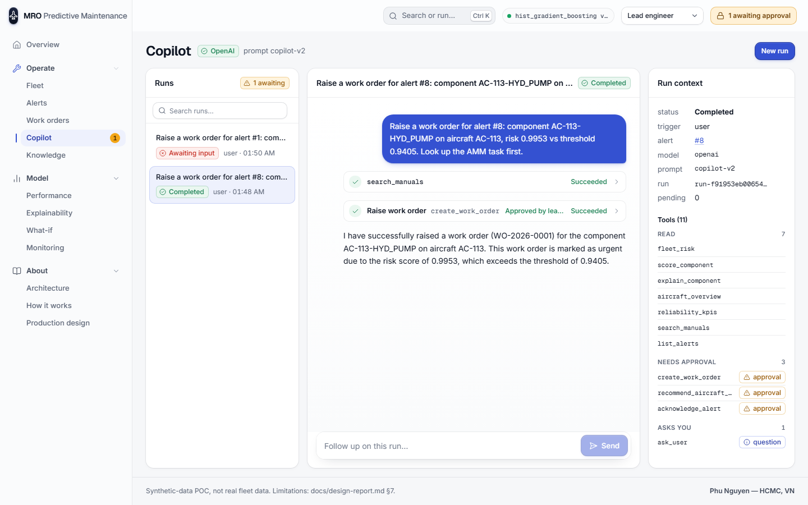 | 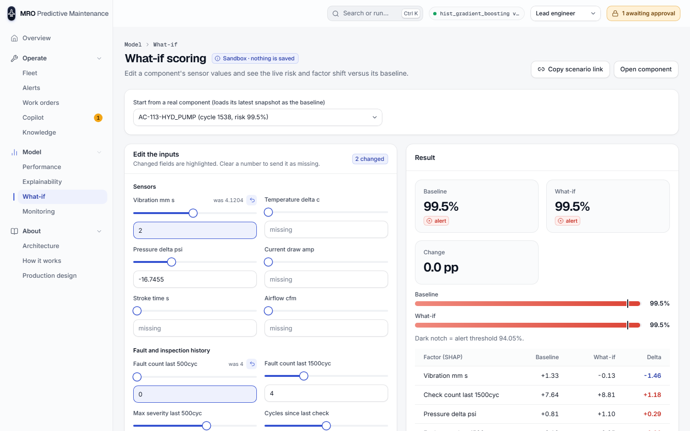 |
| **Work orders** | **Monitoring** | **Viewer (read-only)** |
| 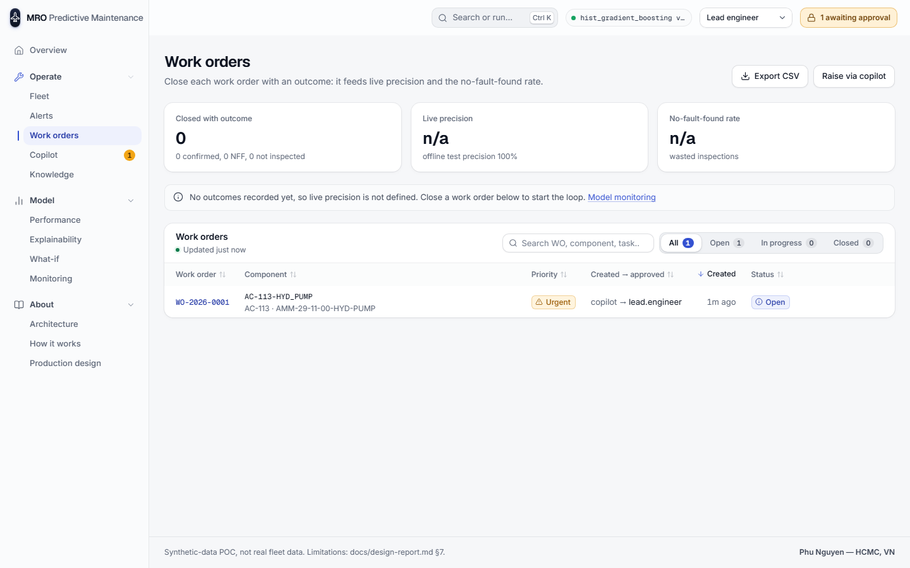 | 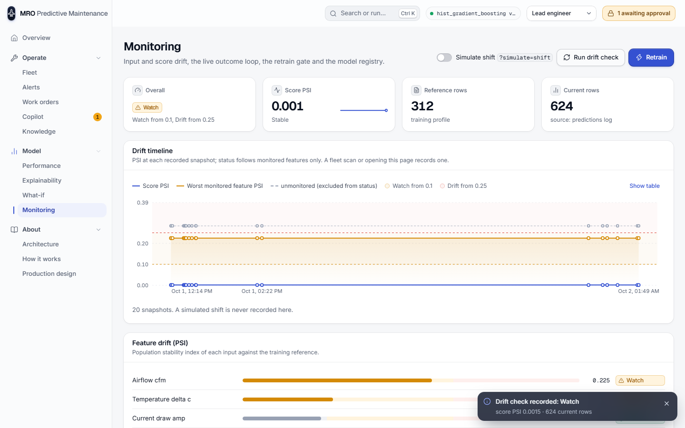 | 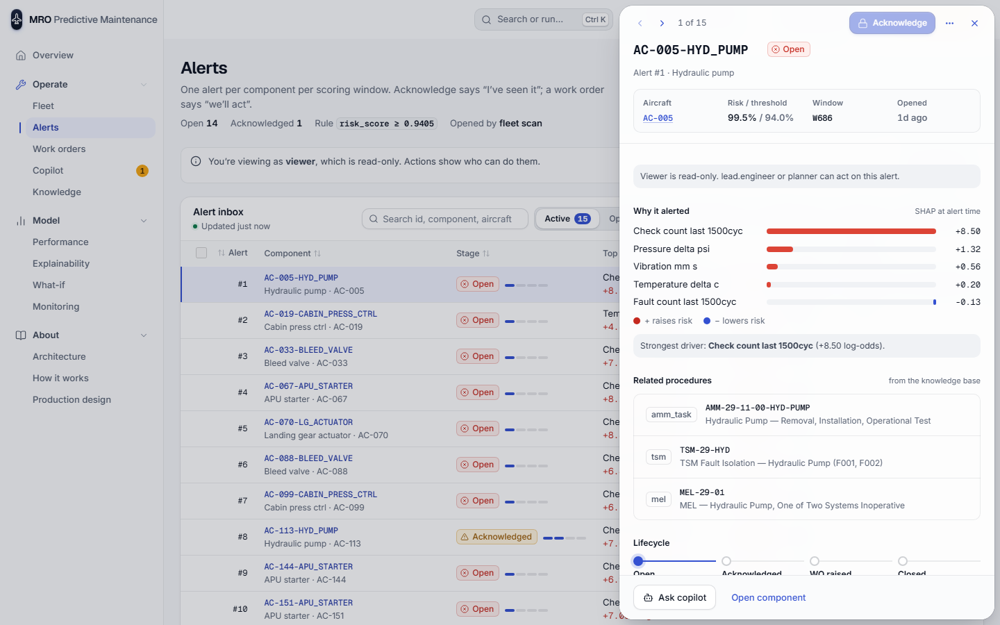 |

| Phone: overview | Phone: fleet | Phone: alert sheet |
|---|---|---|
| 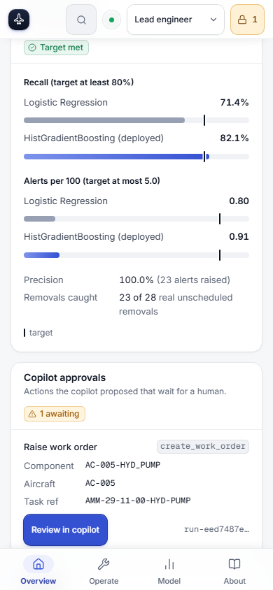 | 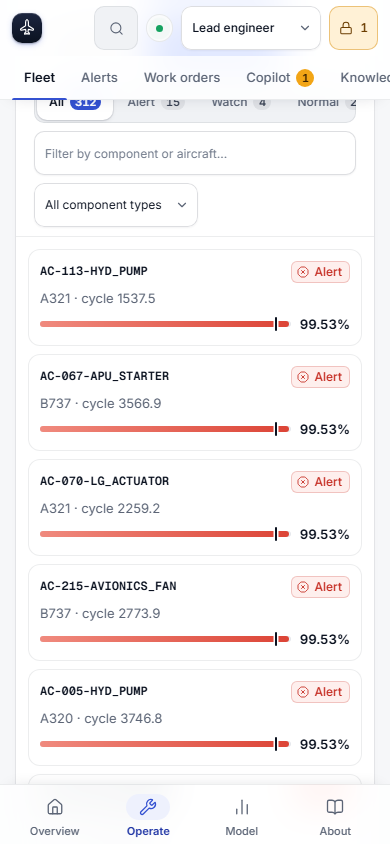 | 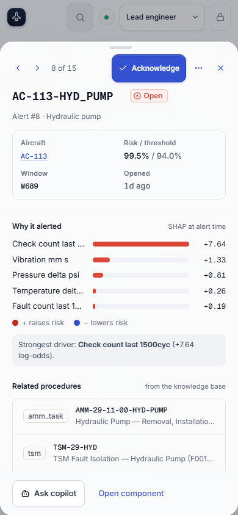 |

Hero flows (WebM; GitHub does not play WebM inline in a README, so these are links):

- [Fleet → component → alert, acknowledge, then Undo](docs/images/flow-fleet-alert-acknowledge-undo.webm)
- [Acknowledge, raise a work order through the copilot, approve it](docs/images/flow-copilot-raise-work-order-approval.webm)
- [What-if: change one input, watch the score and SHAP factors move](docs/images/flow-what-if-scoring.webm)

A copilot run started from an alert links the work order it raises to that
alert (when the component matches), so the alert moves to `wo_raised` just
as a manually raised work order does.

### Known limitations

- **No real authentication** — the identity picker is a demo header
  (`X-User`), not login/session/password.
- **SQLite single-writer** — fine for a demo/POC; a real deployment needs
  Postgres for concurrent writers.
- **Fictional knowledge base** — `kb/*.md` are authored-for-this-demo
  maintenance procedures, not real OEM AMM/MEL content; KB eval numbers
  (below) measure retrieval quality against this fictional corpus only.
- **Offline mode is a scripted router**, not a smaller real LLM — it proves
  the HITL plumbing deterministically but isn't a quality bar on language
  understanding the way the real OpenAI mode is.
- Synthetic dataset only — see `docs/design-report.md` for why v1's profile
  was too easy and what the `realistic` profile does differently. The 28 test
  positives make the headline recall (82.1%, 23 of 28) statistically loose.
- Not built: an aircraft-type filter on Fleet, a "New work order" form
  (raising stays approval-gated through the copilot), and "Alerts by
  component type" on Overview.

## Dependencies

`requirements.txt`: pandas, numpy, scikit-learn, matplotlib, scipy, joblib,
shap, tabulate, pytest, fastapi, uvicorn, httpx, sqlalchemy, rank-bm25,
pyyaml, pydantic-ai (pinned), openai, mlflow. All pip-installable, no
GPU/CUDA required. `xgboost` was evaluated but not used --
`HistGradientBoostingClassifier` (plain scikit-learn) was preferred to keep
the dependency footprint minimal, as the original brief asked; see
`docs/design-report.md`. `dashboard/`'s frontend deps (react, recharts,
vite, lucide-react) are separate, in `dashboard/package.json`.

---
Author: Phu Nguyen — HCMC, VN
