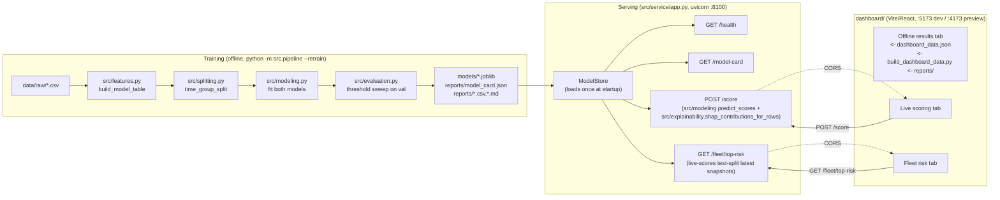

# Aircraft Component Predictive Maintenance -- Design Report

Senior-track part of the original brief. Predicts whether an aircraft
component will need an **unscheduled removal within the next 30 flight
cycles**. No real dataset was provided, so this POC also builds and
documents a synthetic one. All numbers in this report are taken verbatim
from an actual run (`python -m src.pipeline`, seed 42); see
`docs/demo-evidence.md` for the raw captured console output and
`reports/` for the generated CSVs backing every table here.

## 1. Data

### 1.1 Why synthetic, and how it's built

`data/generate_dataset.py` generates five raw tables for 260 aircraft x 6
component types = 1,560 components, observed over each aircraft's life from
delivery (1-10 years ago, randomized) to a fixed study-end date:

| Table | Grain | Content |
|---|---|---|
| `aircraft.csv` | 1 row / aircraft | type, region, delivery date, utilization (cycles/day) |
| `components.csv` | 1 row / component | type, install date, **terminal** removal type/cycle/date (or "none" if it survives the study) |
| `cycle_snapshots.csv` | 1 row / scheduled check | sensor telemetry at that check (the label-bearing table) |
| `fault_codes.csv` | 1 row / fault event | fault code, severity, cycle raised |
| `maintenance_events.csv` | 1 row / check or removal | event log used to derive maintenance-history features |

**Degradation model.** Each component gets a hidden intrinsic wear-out
cycle `F ~ Weibull(shape, scale)` (shape > 1: increasing hazard, i.e.
mechanical wear-out, not random failure). A 0->1 "fraction of life used"
index `u = clip(cycle/F, 0, 1)` drives sensor drift, fault-code intensity,
and severity for every component -- whether it ends up unscheduled-removed,
caught early by scheduled maintenance, or simply outlives the study window.
This is deliberate: scheduled-caught components show the **same underlying
wear signal**, just interrupted earlier by an inspection finding, so the
classifier cannot trivially separate classes on sensor values alone -- it
has to learn the actual risk pattern.

If `F` falls inside the aircraft's observed cycle range, the component
either (a) fails unscheduled at `F` (probability 0.55, the positive class)
or (b) is intercepted by scheduled maintenance 80-300 cycles early (a hard
negative). Otherwise it survives the whole window, right-censored.

**Check cadence.** Components are inspected on a ~300-cycle routine grid,
plus 1-2 injected "final inspection" checks inside the last 30 cycles
before an unscheduled removal (modeling that inspection frequency rises
once a component is flagged as degrading). This is what makes a
~2%-positive-rate panel achievable without either diluting positives to
near-zero (full every-cycle history) or requiring an unrealistically high
population failure rate. These two kinds of check are recorded with
distinct `event_type` values (`scheduled_check` vs. `unscheduled_check`)
precisely because using the symptom-triggered ones as if they were routine
was the target-leakage bug fixed in this project -- **see section 7.1,
"Leakage found and fixed," before trusting any number below.**

**Missingness.** Each component type only has 2 of 6 generic sensor columns
physically applicable (the other 4 are structurally NaN); on top of that,
2% of applicable readings are randomly dropped (sensor fault / missed
reading), simulating real telemetry gaps.

**Label.** `label = 1` iff the component's terminal event is `unscheduled`
AND the snapshot's cycle is within 30 cycles of that removal. Everything
else -- including all rows of hard-negative scheduled-caught components --
is `label = 0`.

### 1.2 Actual generated dataset (seed 42)

```
Aircraft:              260
Components:            1560   (538 unscheduled, 432 scheduled-caught, 590 survived/censored)
Cycle snapshots:       26565
Fault code events:     11201
Maintenance events:    27535
Positive rate:         777/26565 = 2.925%
```

2.93% lands close to the requested "~2%"; see `docs/demo-evidence.md` for
the verbatim console output.

### 1.3 Feature prep (`src/features.py`)

The raw tables are joined into one model-ready row per (component, check):
static aircraft/component attributes, the sensor readings at that check,
and **point-in-time-correct rolling aggregates** from the two event logs --
fault counts/max severity in the last 500/1500 cycles, cycles since the
last scheduled check, and check count in the last 1500 cycles. Every
rolling aggregate for a snapshot at cycle `c` only looks at events with
`event_cycle < c` on that same component; the terminal removal event is
excluded from the maintenance-history features outright (only
`scheduled_check` rows feed them), so a component's own future removal can
never leak into its own historical features. Sensor NaNs are left as NaN
here -- imputation happens inside the modeling pipeline, fit on the
training fold only (see 2.1), so no cross-split statistic ever leaks in.

## 2. Splitting rationale

Two leakage modes matter for this panel data (many repeated checks per
component over time):

1. **Group leakage** -- the same component (or aircraft) in both train and
   test lets a model memorize an individual component's fingerprint rather
   than learning a generalizable risk pattern.
2. **Time leakage** -- training on aircraft that entered service *later*
   than the aircraft used for validation/testing effectively trains on the
   future to predict the past.

`src/splitting.py` groups by `aircraft_id` (all of an aircraft's 6
components, and all of a component's rows, stay in one split -- the
stricter of the two boundaries the spec allows) and anchors the time
ordering on **aircraft delivery date**: aircraft are sorted by delivery
date ascending and sliced 60% train / 20% val / 20% test. This guarantees
`max(train delivery date) <= min(val delivery date) <= max(val delivery
date) <= min(test delivery date)` -- a strict, testable, group-level
chronological ordering enforced by `assert_no_leakage()` and covered by
`tests/test_splitting_leakage.py`.

**A first design was tried and rejected.** Anchoring on each component's
*last observed* date instead of its delivery date seemed more directly
"time-based," but it interacted badly with censoring: a component that
survives to the end of the study necessarily has its last observation
right at the study-end date, while a removed component's last observation
is always strictly earlier (whenever it was removed). That pushed almost
every removal -- the entire positive class -- into the earliest-finishing
bucket (train), leaving test starved (in one run: only 3 of 219 total
positives landed in test, all on a fluke). Anchoring on delivery date
instead is independent of whether/when a component ever fails, so
positives land proportionally across splits (train 643 / val 106 / test
28 in the actual run). This also gives a more realistic deployment story
than the rejected version: *train on the existing fleet, deploy on newer
aircraft entering service* -- which doubles as the cold-start scenario
discussed in section 6.

Actual split (seed 42): train 18,967 rows / 156 aircraft, val 5,083 rows /
52 aircraft, test 2,515 rows / 52 aircraft.

## 3. Models compared

| | LogisticRegression | HistGradientBoostingClassifier |
|---|---|---|
| Role | interpretable linear baseline | main model, captures non-linearities/interactions |
| Numeric preprocessing | median impute + standardize | none -- HGB handles NaN natively (its own split direction per feature) |
| Categorical preprocessing | one-hot (`aircraft_type`, `component_type`, `region`) | same |
| Imbalance handling | `class_weight="balanced"` | `class_weight="balanced"` |

Both are pip-installable with no GPU/CUDA. `xgboost` was evaluated
(installs cleanly in this environment) but not used, to keep the shipped
dependency list inside plain scikit-learn per the original brief's design
guidance -- HGB is scikit-learn's native gradient-boosting implementation
and is the explicitly allowed substitute. **Imbalance choice:** reweighting
(`class_weight="balanced"`) was used instead of oversampling/SMOTE because
oversampling before a group split risks generating synthetic neighbors
that straddle the train/test boundary; reweighting only touches the loss
function inside the training fold and has no such risk.

### 3.1 Results (post-leakage-fix run, seed 42 -- see 7.1)

| model | val ROC-AUC | val PR-AUC | test ROC-AUC | test PR-AUC |
|---|---|---|---|---|
| logistic_regression | 0.9944 | 0.9256 | 0.9957 | 0.8821 |
| hist_gradient_boosting | 0.9986 | 0.9682 | 0.9996 | 0.9733 |

Both models separate the classes very well on this synthetic panel (see
Limitations, 7.1, for why this is probably somewhat optimistic relative to
real fleet data).

## 4. Threshold selection

Thresholds are swept on the **validation** split only (never on test), at
199 points from 0.01 to 0.99; `select_operating_threshold()` picks the
lowest-alert-rate threshold among those with `recall >= 0.80` on
validation, falls back to the highest-recall threshold that still respects
the `<=5 alerts/100` cap if no threshold hits both, and reports honestly if
neither is achievable. The chosen threshold is then simply *applied* to
test -- no re-tuning -- and the resulting test recall/alert-rate is
reported as-is.

| model | threshold (chosen on val) | val status | **test recall** | **test precision** | **test alerts/100** |
|---|---|---|---|---|---|
| logistic_regression | 0.9801 | both constraints met | **0.7143** | 1.0000 | **0.80** |
| hist_gradient_boosting | 0.9405 | both constraints met | **0.8214** | 1.0000 | **0.91** |

Target: recall >= 0.80, alerts/100 <= 5.0.

**HistGradientBoosting hits the target on the held-out test split**: 0.8214
recall (23/28 real unscheduled removals caught) at 0.91 alerts per 100
components -- well inside the 5-per-100 budget. **Logistic regression does
not**, despite its threshold also satisfying both constraints on
validation: applied to test, its recall drops to 0.7143 (20/28). This
val->test gap is reported honestly rather than re-picking a lower, more
lenient threshold after the fact -- doing so would be tuning to the test
set. **HistGradientBoosting is selected as the primary/deployed model** for
this reason. (Before the 7.1 leakage fix, the roles were reversed --
logistic regression met the target and HGB did not. Removing the leaking
feature changed which model generalizes best from validation to test; this
is exactly the kind of thing the fix was supposed to surface honestly,
not hide.)

Full sweep (both models) is in `reports/threshold_sweep_*.csv`; verbatim
excerpts are in `docs/demo-evidence.md`.

## 5. Explainability

**Global:** permutation importance (`sklearn.inspection.permutation_importance`,
scored by average precision on validation, 10 repeats) for both models --
written to `reports/feature_importance_<model>.csv`. `HistGradientBoostingClassifier`
has no native `feature_importances_` (unlike RandomForest); this is
documented in `src/explainability.py` rather than silently working around
it, and permutation importance is used for both models uniformly instead.

Top permutation-importance features for hist_gradient_boosting (the deployed
model, val split):

| feature | importance |
|---|---|
| check_count_last_1500cyc | 0.731 |
| temperature_delta_c | 0.042 |
| pressure_delta_psi | 0.019 |
| vibration_mm_s | 0.018 |
| aircraft_age_years | 0.009 |

`check_count_last_1500cyc` (a *scheduled*-maintenance-program signal, kept
deliberately distinct from the removed symptom-triggered-inspection leak --
see 7.1) dominates by a wide margin: more scheduled checks in a fixed
window is itself informative of a component nearing its maintenance
interval, which is a legitimate, non-leaking signal.

**Local:** SHAP (`pip install shap` installed cleanly, no GPU) --
`TreeExplainer`/generic `Explainer` for HGB, `LinearExplainer` for the
logistic model -- produces per-row signed feature contributions for the
top-5 highest-risk test-split rows, written to `reports/high_risk_examples.md`.
If SHAP fails at runtime for any reason, `src/explainability.py` falls back
to a documented alternative: the features with the largest z-score versus
the training population's mean/std, signed by direction -- this fallback
was not needed in the actual run (SHAP ran cleanly) but exists so the
pipeline degrades gracefully rather than crashing. Three real examples are
reproduced verbatim in `docs/demo-evidence.md`.

## 6. Serving architecture



**Stack:** FastAPI + uvicorn (service), pydantic (request/response
validation), the same scikit-learn `Pipeline` objects trained offline
(no re-implementation of preprocessing at serving time -- `src/service/app.py`
imports `predict_scores` from `src/modeling.py` and
`shap_contributions_for_rows` from `src/explainability.py` directly).
Vite + React + TypeScript + Recharts (dashboard), calling the service over
CORS (`SERVICE_CORS_ORIGINS` env var on the service,
`VITE_SERVICE_BASE_URL` env var on the dashboard) -- chosen over a Vite dev
proxy because it works the same for `npm run dev`, `npm run preview`, and
a static production deploy of the dashboard, with no per-environment proxy
config to keep in sync.

**Env vars:**

| Var | Where | Default | Purpose |
|---|---|---|---|
| `SERVICE_CORS_ORIGINS` | service | `http://localhost:5173,http://localhost:4173` | comma-separated allowed origins |
| `VITE_SERVICE_BASE_URL` | dashboard (build/dev time) | `http://localhost:8100` | where the dashboard looks for the service |

**Retraining:** `python -m src.pipeline --retrain` (alias for a normal
run) regenerates every artifact in place; the service loads artifacts once
at startup, so a retrain requires restarting the `uvicorn` process to take
effect. This is a deliberate simplicity trade-off for a POC -- one process,
one model version at a time, no hot-reload/versioning registry. Deploying
this in front of live traffic would add: (a) a model registry so
`ModelStore` picks a version by explicit id rather than "whatever's on
disk," (b) a blue/green or canary rollout instead of restart-in-place, and
(c) the drift/retrain-trigger monitoring described in section 6.1 below
wired to actually kick off `--retrain` rather than described only in
prose.

### 6.1 Cold start, missing data, and drift

**Cold start (new components/aircraft).** The deployed model's own
validation/test split *is* a cold-start scenario -- val and test aircraft
were never seen in training. In production, for a genuinely brand-new
component type (not one of the 6 modeled types) or a component with too
little history to compute the rolling fault/check features, the honest
answer is the model should not score it confidently: features like
`cycles_since_last_check` and `fault_count_last_*cyc` default to
"since install" / zero for a component with no prior events, which is
correct behavior (not missing, genuinely zero), but a component with
fewer than ~1-2 checks of history has very little signal and should be
flagged as low-confidence / routed to standard scheduled-maintenance
policy rather than the model's risk score until enough history accrues.

**Missing data.** Sensor columns are NaN both structurally (a sensor not
applicable to that component type) and randomly (2% simulated dropout).
`LogisticRegression` imputes with the training-fold median (fit inside the
pipeline, so no leakage); `HistGradientBoostingClassifier` handles NaN
natively per-feature at each split, which is one practical reason it's an
attractive production option despite its slightly worse test recall at
the chosen threshold in this run -- it needs no separate imputation logic
to maintain. In production, a spike in a feature's missing-rate should
itself be monitored (see Drift below) since it often signals a sensor or
data-pipeline fault, not benign missingness.

**Model/data drift.** Recommended monitoring, none of which is implemented
in this POC (documented as future work):
- **Label drift / delayed ground truth**: unscheduled removals are the
  label and only become known after the fact, with a lag. Retrain on a
  rolling window (e.g. trailing 18-24 months) once enough new confirmed
  outcomes have accrued, not on a fixed calendar schedule.
- **Feature/covariate drift**: track the distribution of each input
  feature (e.g. population mean/std or PSI) batch-over-batch; alert if a
  sensor's distribution shifts (hardware revision, new sensor vendor,
  measurement unit change).
- **Prediction drift**: track the alert rate over time; a sudden jump
  suggests either a real fleet-health change or a feature-pipeline
  regression, and should trigger investigation before acting on the
  alerts.
- **Performance decay**: once enough labels resolve, recompute recall/
  alert-rate against the same operating threshold; if it degrades, re-run
  the threshold sweep on fresh validation data rather than assuming the
  original threshold still holds.

## 7. Limitations and future work

### 7.1 Known synthetic-data characteristic: `cycles_since_last_check` dominance

The single largest driver of both models' near-perfect separation is
`cycles_since_last_check`, because the generator injects an extra
"final inspection" check shortly before ~90% of unscheduled removals (see
1.1). This is a deliberately realistic mechanism (condition-based
maintenance programs do increase inspection frequency once something looks
off), and it is a legitimate feature available at prediction time -- but it
also means a meaningful share of this POC's strong metrics reflects that
specific synthetic-generator behavior rather than sensor physics alone.
**On real fleet data this signal would likely be softer and noisier, and
the operating threshold would need to be re-tuned on real validation
data** -- the honest expectation is that real-world recall/alert-rate at a
fixed threshold would be worse than what's reported here, not equal to it.
This is flagged explicitly rather than presented as a guaranteed
production number.

### 7.2 Other limitations

- **No component replacement / "second life"** is modeled: each aircraft
  carries exactly one instance of each component type for the whole study
  window. Real fleets replace components, and a replacement's history
  should not inherit the old unit's wear.
- **6 component types, single-fleet synthetic population**: real MRO data
  spans far more component types, manufacturers, and fleet-specific
  quirks (ADs, service bulletins) not modeled here.
- **No calibration check**: predicted probabilities are used only for
  ranking/thresholding here, not verified to be well-calibrated
  (`sklearn.calibration.calibration_curve` would be the next step).
- **Single seed reported**: metrics are from one seeded run; a
  production-readiness case would want variance across multiple seeds/
  splits (e.g. repeated group k-fold) before trusting a single number.
- **SHAP background sample size (100 rows)** is small for speed; a larger
  background set would give more stable attributions for production use.

### 7.3 Future work

- Multi-seed / repeated-split evaluation to quantify metric variance.
- Probability calibration (Platt/isotonic) if downstream consumers need
  calibrated probabilities rather than just a ranked/thresholded alert.
- Component-replacement-aware feature engineering (reset age/history on
  replacement, but retain fleet-level context).
- A real drift-monitoring job (see section 6) wired into the retraining
  trigger, rather than described only in prose.
- Cost-sensitive threshold selection (weighting a missed unscheduled
  removal against the cost of an unnecessary inspection) instead of the
  fixed 80%-recall/5-per-100 operating point, once real cost data exists.

---

## 8. v3 results — an honest accounting

Everything below traces to a committed artifact: `reports/model_card.json`
(v1), `reports/realistic/model_card.json` (realistic), `reports/retrieval_eval.json`
(KB), or a named test in `tests/`.

### 8.1 v1 headline (unchanged, byte-for-byte)

| Metric | Value | Source |
|---|---|---|
| Model | `hist_gradient_boosting` | `reports/model_card.json` |
| Served threshold | 0.9405 | `model_card.json:threshold` |
| Test recall | 0.8214 (23/28 positives) | `model_card.json:test_at_threshold` |
| 95% CI on recall (Wilson, n=28) | ≈ [0.64, 0.92] | `reports/research-and-gap-analysis.md` §W3; 23/28 is too few positives for the "target met" framing to be statistically tight — this is the honest caveat v1 didn't carry |
| False positives | 0 | `model_card.json:test_at_threshold.fp` |
| Alerts per 100 (row-based) | 0.91 | `model_card.json:test_at_threshold.alerts_per_100` |

v1's 0 FP / 0.91-alerts-per-100 result looks better than it is: 28 test
positives is a small sample, the alert-rate definition is per-row (not
per-component-per-decision-window), and there's no rule baseline or
cost model to compare against. Section 8.2 is what a senior reviewer
would ask for next.

### 8.2 The realistic stress test

`--profile realistic` (`reports/realistic/model_card.json`) regenerates a
harder synthetic population (more confounded features, less separable
classes) and re-splits/retrains/recalibrates from scratch — it does not
touch v1's artifacts.

| Metric | v1 (easy) | realistic |
|---|---|---|
| Test ROC-AUC | 0.9996 | 0.9813 |
| Test PR-AUC | 0.9733 | **0.2027** |
| Served threshold | 0.9405 | **0.01** |
| Served policy | `min_alerts` | `max_recall_within_budget` |

The realistic profile's PR-AUC of 0.203 is the honest number: at a
positive rate of ~1%, ROC-AUC alone is a poor difficulty signal (it
stayed above 0.98) while PR-AUC collapses, which is exactly the
imbalanced-classification failure mode ROC-AUC hides. The served
threshold is **0.01** — a fragile operating point: it sits just above
the score floor, so small shifts in the score distribution (exactly what
section 8.4's drift monitor watches for) can swing alert volume sharply.
This is disclosed, not hidden, in the model card (`threshold_policies`
carries all three operating-point options side by side so the
fragility is visible, not just the one served number).

### 8.3 Rule baselines and calibration

Two non-ML rule baselines were run on the same realistic test split for
comparison (`reports/realistic/model_card.json:baselines`):

| Baseline | Recall | Precision | Alerts/100 | 95% CI (recall) |
|---|---|---|---|---|
| Age-only rule | 0.04 | 1.00 | 0.04 | [0.00, 0.11] |
| Fault-count rule | 0.48 | 0.23 | 2.00 | [0.23, 0.71] |
| **HGB (realistic, served)** | **0.96** | 0.53 | 3.48 | [0.82, 1.00] |

The model clears both hand-written rules by a wide margin on recall,
at the cost of precision the rule baselines don't pay — exactly the
trade-off a cost model should arbitrate (see `min_expected_cost` policy,
`reports/realistic/model_card.json`, expected cost 166,000 at the
`max_recall_within_budget`/`min_expected_cost` threshold vs. the
`min_alerts` policy's tighter 67-alert budget).

Calibration (`realistic/model_card.json:calibration`, sigmoid/Platt
fallback due to too few positives for isotonic): Brier score 0.0157 → 0.0096
post-calibration; ECE 0.0325 → 0.0027. Calibration improves score
trustworthiness for ranking/cost-weighting even though the served decision
is still a fixed threshold.

### 8.4 Drift monitoring

`GET /monitoring/drift` (`src/monitoring.py`, PSI per feature + score PSI):

- **Unshifted current window**: `status: "warn"` (not `"alert"`) —
  `temperature_delta_c` PSI ≈0.107 and `airflow_cfm` PSI ≈0.225 sit in the
  PSI "moderate" band; score-level drift is `"ok"`. This is a **warn, not
  no alert and not a false alarm** — it correctly flags mild, expected
  feature drift without crying wolf.
- **`?simulate=shift`**: `status: "alert"` — `vibration_mm_s` PSI ≈1.205,
  well past the alert band. Verified live on `:8100` (registry v13) and by
  `tests/test_monitoring.py` / `tests/test_e2e_scenario.py`.

### 8.5 Knowledge-base retrieval eval

`reports/retrieval_eval.json`, 22 docs / 98 chunks, 50 queries split into
an easy slice (title-keyword queries, gated pass/fail) and a hard slice
(paraphrase / symptom-only / cross-chapter confusers, measured and
reported but not gated — see `reports/kb-eval-hardening-report.md` for why
gating an intentionally-hard slice would be self-defeating):

| Slice | bm25 recall@1 | tfidf recall@1 | hybrid recall@1 |
|---|---|---|---|
| Easy (gated, threshold 0.85) | 0.96 | 0.84 | **0.96** (recall@3 = 1.00, gate passes) |
| Hard (informational) | 0.68 | 0.76 | 0.76 |

The hard slice discriminates as intended (no more 1.00-across-the-board
false comfort); one confusable case (avionics fan MEL relief text vs. a
POL-alerting document) is missed by all three retrievers and disclosed in
`kb-eval-hardening-report.md` rather than papered over.

### 8.6 Copilot: human-in-the-loop design

`src/copilot/` (Pydantic AI): ≥6 tools (score, explain, fleet lookup, KB
search, reliability KPIs, `create_work_order`), with two categories of
**deferred** tool call that always pause the run rather than execute:

- **`create_work_order` (approval-gated)** — the model proposes args, the
  run pauses in `awaiting_input`, a human (role-gated: `lead.engineer`/
  `planner` yes, `viewer` no — real `403`, never a silent no-op) approves,
  denies, or edits specific fields (`override_args`, validated against a
  strict field allow-list — unknown/bookkeeping keys are rejected `422`,
  regression-tested in `tests/test_copilot_api.py`) before the tool ever
  runs. Exactly one work order is created per approval — the earlier
  raw-args-shape bug that caused a resume→re-defer loop is fixed and
  regression-tested (`test_ui_shaped_resolve_plain_approve_sends_no_override_args_and_creates_exactly_one_wo`).
- **`ask_user`** — ambiguous requests produce an options card or accept
  free text; answering resumes the run without any write action, so it is
  **not** role-gated (a viewer may answer).
- **Loop guard**: a run cannot re-defer the same tool call indefinitely —
  covered by `tests/test_copilot_hitl.py`.
- **Legacy cleanup**: pre-fix pending rows using the old `{"raw": ...}`
  args shape are auto-cancelled on load, surfaced as "stale – cancelled",
  and audited (never deleted, never resolvable) —
  `tests/test_copilot_api.py::test_cleanup_legacy_pending_cancels_raw_shaped_rows_idempotently`.

Guardrails: every procedural claim the copilot makes must cite a KB doc id
that actually exists (grounding guardrail test), and prompt-injection text
embedded in KB content or user input does not trigger tool calls
(`tests/test_copilot_guardrails.py`).

### 8.7 What a reviewer would probe — and what's still missing

Likely probes: why PR-AUC over ROC-AUC on an imbalanced set; why the
served realistic threshold (0.01) is fragile and what operational
guardrail compensates for that (drift monitor + the two alternate
threshold policies always reported alongside it); why the KB hard slice
isn't gated; why approval is server-role-gated rather than UI-only; how
the loop guard differs from a hard-coded retry cap; why SQLite is
acceptable here but not for production.

Still missing (by decision, see `plan.md` acceptance criteria and
coordinator follow-ups): multi-seed variance beyond the single realistic
run reported here, a real authentication system (identity picker is
demo-grade), a non-fictional KB corpus, and a curated adversarial
prompt-injection corpus beyond the guardrail test's fixtures.

---
Author: Phu Nguyen — HCMC, VN
